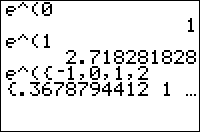

           
|Command Summary|Command Syntax|[Calculator Compatibility](compatibility.html)|[Token Size](tokens.html)|
|--- |--- |--- |--- |
|Raises the constant *e* to the *value* power.|*e*^(*value*)|TI-83/84/+/SE|1 byte|

### Menu Location
Press [2nd] [*e*<sup>x</sup>] to paste *e*^(.
       
# The e^( Command

The `*e*^(` command raises the constant `*[e](e-value.html)*` to a power. Since it's possible to just type out `*e*`, ^, and (, the reason for having a separate function isn't immediately obvious but in fact most of the time you need to use `*e*`, it's to raise it to a power.

The trigonometric and hyperbolic functions can be expressed, and in fact are usually defined, in terms of `*e*^(`. 

`*e*^(` accepts numbers and lists (but unfortunately not matrices) as arguments. It also works, and is often used for, complex numbers (in fact, one of the standard forms of complex numbers on TI-83 series calculators is [`re^θi`](re-thetai.html), which uses the `*e*^(` function`)`

```
e^(2)
		7.389056099
e^(πi)
		-1
e^({-1,0,1})
		{.3678794412 1 2.718281828}
```

## Formulas

The `*e*^(` is usually defined by an infinite series:

$$
e^x=\sum_{n=0}^\infty{\frac{x^n}{n!}}$$

This is then used to define exponentiation in general (for all real and even complex numbers), rather than using some sort of definition of exponents that involves multiplying a number by itself many times (which only works for integers).

## Related Commands

- `*[e](e-value.html)*`
- [`ln(`](ln.html)
- [`10^(`](ten-exponent.html)
