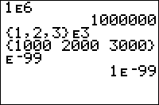

           
|Command Summary|Command Syntax|[Calculator Compatibility](compatibility.html)|[Token Size](tokens.html)|
|--- |--- |--- |--- |
|The E symbol is used for entering numbers in scientific notation.|*mantissa* E *exponent*|TI-83/84/+/SE|1 byte|

### Menu Location
Press [2nd][EE] to paste the E command.
       
# The E Command


The `E` symbol is used for entering numbers in scientific notation: it's short for *10^. This means that in many cases, its function is identical to that of the [`10^(`](ten-exponent.html) command (aside from the parenthesis). However, the exponent of `E` is limited to constant integer values ‾99 to 99.

The `E` symbol is used in display by the calculator for large numbers, or when in [`Sci`](sci.html) (scientific) or [`Eng`](eng.html) (engineering) mode.

Unlike the exponent of `E`, the mantissa (a special term for the A in A*10^B, in scientific notation) isn't limited in variable type: it can be a constant, a real or complex variable or expression, a list, a matrix, or even omitted entirely (and then it will be assumed to equal 1). The reason for this versatility is simple: internally, only the exponent is taken to be an actual argument for this command. The rest of the calculation is done through implied multiplication.

```
5E3
..................[[/span]]5000
E‾5
..................[[/span]].00001
```


## Advanced Uses

`E`99 and -`E`99 are often used for negative and positive infinity because the TI-83 series of calculators doesn't have an infinity symbol. Commands that often need to use infinity include [`solve(`](solve.html), [`fnInt(`](fnint.html), [`normalcdf(`](normalcdf.html) (and the other distributions), and many others. The error introduced in this way is usually irrelevant, because it's less than the minimum calculator precision, anyway: `E`99 is mindbogglingly huge.

## Optimization

Don't add the mantissa when it's 1: 

```
1E5
should be
E5
```

In addition, `E`2 or `E`3 can be used as shorthand ways of writing 100 and 1000 respectively. This could be continued, in theory, for higher powers of 10, but those aren't necessary as often.

## Command Timings

`E` is much faster than using the [`10^(`](ten-exponent.html) command or typing out 10^. The drawback, of course, is that it's limited to constant values.

## Related Commands

- [`^`](power.html)
- [`10^(`](ten-exponent.html)
- [`e^(`](e-exponent.html)
