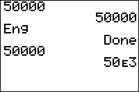

           
|Command Summary|Command Syntax|[Calculator Compatibility](compatibility.html)|[Token Size](tokens.html)|
|--- |--- |--- |--- |
|Puts the calculator in engineering notation mode.|Eng|TI-83/84/+/SE|1 byte|

### Menu Location
While editing a program, press:<br># MODE to access the mode menu.<br># Use arrows and ENTER to select Eng.
# The Eng Command

The `Eng` command puts the calculator in engineering notation mode. This is a variation on scientific notation in which the exponent is restricted to be a multiple of 3 (and the mantissa can range between 1 and 1000, not including 1000 itself)

```
Eng
		Done
12345
		12.345e3
{1,2,3}
		{1e0 2e0 3e0}
```

## Related Commands

- [`Normal`](normal.html)
- [`Sci`](sci.html)
- [`Float`](float.html)
- [`Fix`](fix.html)
