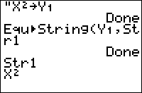

           
|Command Summary|Command Syntax|[Calculator Compatibility](compatibility.html)|[Token Size](tokens.html)|
|--- |--- |--- |--- |
|Stores the contents of an equation variable to a string.|Equ►String(*equation*,*string*|TI-83/84/+/SE|2 bytes|

### Menu Location
This command is found only in the catalog. Press:
1. 2nd CATALOG to access the catalog
2. F to skip to commands starting with F
3. Scroll up to Equ►String( and select it.
       
# The Equ►String( Command

This command stores the contents of an equation variable (such as Y<sub>1</sub> or X<sub>1T</sub>) to a string (one of Str0, Str1, ... Str9). This can be used when you want to display the equation as text (either using the [`Text(`](text.html) command on the graph screen, or the [`Output(`](output.html) or [`Disp`](disp.html) commands on the home screen). For example:

```
:Equ►String(Y1,Str1
:Text(0,0,"Y1(X)=",Str1
```

Apart from cases in which the user has already stored to the equation variable prior to running the program, about the only situation in which you would use `Equ►String(` is for the output of a [regression](regression-models.html).

## Advanced

You can use `Equ►String(` (outside a program) to get the [`→`](store.html) or " symbols in a string:

1. Type them on the home screen and press [ENTER]
2. Select 2:Quit when the **[ERR:SYNTAX](errors.html#syntax)** comes up.
3. Press [Y=] to go to the equation editor.
4. Press [2nd] [ENTRY] to recall the symbols to Y<sub>1</sub>
5. Now, use `Equ►String(`Y<sub>1</sub>,Str1`)` to store the symbols to a string.

## Related Commands

- [`String►Equ(`](string-equ.html)
- [`expr(`](expr.html)

## See Also

- [`Number to String`](number-to-string.html)
