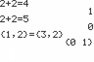

           
|Command Summary|Command Syntax|[Calculator Compatibility](compatibility.html)|[Token Size](tokens.html)|
|--- |--- |--- |--- |
|Returns true if value1 is equal to value2.|*value1*=*value2*|TI-83/84/+/SE|1 byte|

### Menu Location
Press:<br># 2nd TEST to access the test menu.<br># 1 to select =, or use arrows.
# The = Command

The `=` (equal) operator takes two numbers, variables, or expressions, and tests to see if they are equal to each other. It will return 1 if they are, and 0 if they are not. When determining the order of operations, `=` will be executed after the [math](operators.html#math) operators, but it will be executed before the [logical](operators.html#logical) operators and in the order that it appears from left to right with the other [relational](operators.html#relational) operators.

```
1=0
           0
0->X
           0
3→Y
           3
X=Y
           0
```

## Precision

The TI-84+ calculator appears to round numbers to 10 significant digits when checking for equality (even though behind the scenes in memory numbers are stored up to 14 digits). So for example:

```
0.99999999999=1       // True  (11 digits get rounded to 10)
0.9999999999=1        // False (with 10 digits not rounded)
99999.999999=100000   // True  (11 digits get rounded to 10)
99999.99999=100000    // False (with 10 digits not rounded)
```

## Advanced Uses

Just like the other relational operators, = can take real numbers and lists for variables. In order to compare the lists, however, both must have the same dimensions; if they don't, the calculator will throw a [ERR:DIM MISMATCH](errors.html#dimmismatch) error. When comparing a real number to a list, the calculator will actually compare the number against each element in the list and return a list of 1s and 0s accordingly.

```
{2,4,6,8}={1,3,5,7
           {0 0 0 0}
5={1,2,3,4,5
           {0 0 0 0 1}
```

Besides real numbers and lists, `=` also allows you compare strings, matrices, and complex numbers. However, the variables must be of the same type, otherwise the calculator will throw a [ERR:DATA TYPE](errors.html#datatype) error.

```
[[1,2,3]]=[[1,2,3
                      1
"HELLO"="WORLD
                      0
(3+4i)=(5-2i)
                      0
```

When matrices are compared, the result is `1` if the matrices are identical. Both matrices must have the same dimensions, otherwise you will get a [ERR:DIM MISMATCH](errors.html#dimmismatch) error. Internally, the calculator compares values from the bottom right of each matrix, moving left across each row from bottom to top. If unequal elements are found, the calculator returns 0 without examining the rest of the matrix.

## Optimization

When a variable is used in a conditional statement, and the only values that are possible for a variable are 1 and 0, you can get rid of the `=` sign and simply use the variable by itself.

```
:If X=1
can be
:If X
```

## Error Conditions

- **[ERR:DATA TYPE](errors.html#datatype)** is thrown if you try to compare two different kinds of variables, such as a string and number or a list and matrix.
- **[ERR:DIM MISMATCH](errors.html#dimmismatch)** is thrown if you try to compare two lists or matrices that have different dimensions.

## Related Commands

- [≠](notequal.html) (not equal)
- [>](greaterthan.html) (greater than)
- [≥](greaterthanequal.html) (greater than equal)
- [<](lessthan.html) (less than)
- [≤](lessthanequal.html) (less than equal)
