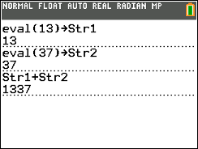

           
|Command Summary|Command Syntax|[Calculator Compatibility](compatibility.html)|[Token Size](tokens.html)|
|--- |--- |--- |--- |
|Returns the string representation of the value of a real expression.|eval(*expression*)|TI-84+ CE OS 5.2|2 bytes|

### Menu Location
This command is found only in the Catalog. Press:
1. 2ND CATALOG to enter the catalog
1. E to go to commands starting with E
1. Scroll down to eval(.
       
# The eval( Command

The `eval(` command, given an expression that evaluates to a real number, returns the string representation of that number.

```eval(1337       //returns "1337"

eval(2.0-3.0    //returns "‾1"

eval(.0001234   //returns "1.234ᴇ‾4"
```


`eval(` has more limitations than the [`toString(`](tostring.html) command. It cannot handle lists, matrices, or complex numbers (even when the imaginary part of the complex number is zero). Another difference from `toString(` is that `eval(` is unaffected by display mode changes like [`Fix`](fix.html).

## Advanced Uses

Use `eval(` in conjunction with [`expr(`](expr.html) to evaluate a real expression in a string and return the answer in a string.

```
3.14->X
eval(expr("2X+3
//returns "9.28"
```

## Error Conditions

- **[ERR:DATA TYPE](errors.html#datatype)** is thrown when the expression contains a list, matrix, imaginary number, or string.
- **[ERR:SYNTAX](errors.html#syntax)** is thrown when trying to evaluate a command that doesn't return a value.

## Related Commands

- [toString(](tostring.html)
- [expr(](expr.html)
