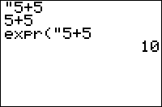

           
|Command Summary|Command Syntax|[Calculator Compatibility](compatibility.html)|[Token Size](tokens.html)|
|--- |--- |--- |--- |
|Returns the value of a string that contains an expression.|expr(*string*)|TI-83/84/+/SE|2 bytes|

### Menu Location
This command is found only in the Catalog. Press:
1. 2ND CATALOG to enter the catalog
2. F to go to commands starting with F
3. Scroll up a bit to expr(.
       
# The expr( Command

The `expr(` command is used to evaluate an expression that's stored in a string (an expression is merely anything that returns a value - of any type). Expressions are occasionally stored to strings, rather than evaluated outright, so that their value has the capacity to change when the variables stored inside them change.  The `expr(` command's result depends on the kind of expression that's in the string you pass it — it may return a number, a list, a matrix, or even another string. 

As a special case of an expression, the `expr(` command can also be used to convert a string like `"123"` to the number `123`. Going in the reverse direction (`123` to `"123"`) is [more complicated](number-to-string.html).

The `expr(` command has limitations. Here are the situations in which `expr(` will not work:

- When the code in the string does not return an answer, and thus is not an expression: e.g. `expr("Line(0,0,1,1"` or `expr("prgmHELLO"` is invalid

- When the expression in the string contains an `expr(` command itself, e.g. `expr("expr(Str1"` — this will throw an [ERR:ILLEGAL NEST](errors.html#illegalnest) error.

- In place of a variable (rather than an expression), e.g. `5→expr("X"` isn't a substitute for `5→X` because `expr("X"` evaluates to the value of `X` and not to `X` itself.

## Advanced Usage with Lists

`expr(` is often used in conjunction with the [`Input`](input.html) command to prompt the user to enter a list. Although the `Input` command can already handle lists, it requires the user to enter the opening bracket that signifies a list. With `expr(`, this can be avoided.

If you want the user to enter a list separated by commas, instead of:
```
Input L₁
```

Use this:
```
Input Str1
expr("{"+Str1→L₁
```

This will automatically put the curly bracket in so the user does not have to.

Just be aware that you *cannot* access individual list items directly after the `expr()` function, unlike how you can with [`Ans`](ans.html). The following code will *multiply* the entire list by 2 rather than return the second item:

```
expr("{1,2}")(2)
```

Instead, to access the second item in the list you could split this across two lines and use `Ans`:

```
expr("{1,2}")
Ans(2)
```

## Optimization

Evaluating an expression inside a string is more complicated than evaluating a normal expression; you should therefore try to take as much out of an `expr(` statement as possible to speed up your code. For example:
```
expr("sum({"+Str1
```

can be:
```
sum(expr("{"+Str1
```

## Error Conditions

- **[ERR:ILLEGAL NEST](errors.html#illegalnest)** is thrown when the string to be evaluated contains an expr( itself.
- **[ERR:INVALID](errors.html#invalid)** is thrown when trying to evaluate the empty string.
- **[ERR:SYNTAX](errors.html#syntax)** is thrown when trying to evaluate a command that doesn't return a value.

## Related Commands

- [sub(](sub.html)
- [inString(](instring.html)
- [length(](length.html)
