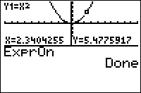

           
|Command Summary|Command Syntax|[Calculator Compatibility](compatibility.html)|[Token Size](tokens.html)|
|--- |--- |--- |--- |
|The equation or plot being traced is displayed in long form at the top of the screen.|ExprOn|TI-83/84/+/SE|2 bytes|

### Menu Location
Press: # 2nd FORMAT to access the graph format menu # Use arrows and ENTER to select ExprOn
# The ExprOn Command

The `ExprOn` command enables a "long" form of displaying the equation or plot being traced. 

In this mode, when tracing an equation, the equation's name and its formula are written in small font at the top of the screen. For example, when tracing Y1 which is equal to 2X, "Y1=2X" will be displayed.

When tracing a plot, the plot number is written, followed by the list or lists that it describes. For example, when tracing Plot1, which is a scatter plot of ∟X and ∟Y, "P1:X,Y" will be displayed.

## Related Commands

- [`ExprOff`](exproff.html)
- [`CoordOn`](coordon.html)
- [`CoordOff`](coordoff.html)
