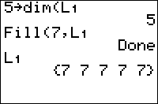

           
|Command Summary|Command Syntax|[Calculator Compatibility](compatibility.html)|[Token Size](tokens.html)|
|--- |--- |--- |--- |
|Fills a list or matrix with one number.|Fill(*value*,*matrix*)|TI-83/84/+/SE|1 byte|

### Menu Location
Press:<br># 2nd LIST to access the list menu.<br># RIGHT to access the OPS submenu.<br># 4 to select Fill(, or use arrows.<br><br>Alternatively, press:<br># MATRX (83) or 2nd MATRX (83+ or higher) to access the matrix menu.<br># RIGHT to access the MATH submenu.<br># 4 to select Fill(, or use arrows.
# The Fill( Command

The `Fill(` command takes an existing list or matrix variable and sets all its elements to a single number. It doesn't return anything and only works on already defined variables.

```
{5}→dim(L1)
Fill(2,L1)
L1
	{2 2 2 2 2}

{3,4}→dim([A])
Fill(1,[A])
[A]
	[[1 1 1 1]
	 [1 1 1 1]
	 [1 1 1 1]]
```

`Fill(` is very fast: on a twenty-element real list, it takes only about 3.5 ms, much less than any vectorized list operation.

When `Fill(` is called on a list, the datatype of the list becomes the datatype of the number. That is, `Fill(1,L₁)` makes `L₁` a real list, and `Fill(i,L₁)` makes `L₁` a complex list.

## Optimization

When creating a new list or matrix you want to fill with zeroes, it's better to delete it then create it with [`dim(`](dim.html), which will set all entries to 0, than to set its dimensions with dim( (which may not clear what was there before) then use Fill(.

## Errors

On a TI-84+CSE, using `Fill(List,List)` will cause a RAM clear. For example: `Fill({1,2,3},{1,2,3`} will cause a RAM Clear. This does not apply on any other models, as they only give you argument and data type errors.

## Related Commands

- [`augment(`](augment.html)
- [`dim(`](dim.html)
- [`seq(`](seq.html)
