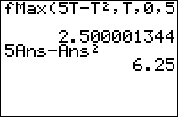

           
|Command Summary|Command Syntax|[Calculator Compatibility](compatibility.html)|[Token Size](tokens.html)|
|--- |--- |--- |--- |
|Calculates the local maximum of a function.|fMax(*f*(*var*),*var*,*lo*,*hi*[,*tol*])|TI-83/84/+/SE|1 byte|

### Menu Location
While editing a program, press:
1. MATH to open the [math](math.html) menu
1. 7 or use arrow keys to select
       
# The fMax( Command

`fMax(*f*(*var*),*var*,*lo*,*hi*[,*tol*])` finds the value of *var* between *lo* and *hi* at which the maximum of *f*(*var*) occurs. *tol* controls the accuracy of the maximum value computed. The default value of *tol* is 10<sup>-5</sup>.

`fMax(` only works for real numbers and expressions. Brent's method for optimization is used for approximating the maximum value.

```
fMax(sin(X)cos(X),X,0,3)
		.7853995667
```

Keep in mind that the result is the value of *var*, and not the value of *f(var)*. In this example, .7853995667 is not the highest possible value of sin(X)cos(X), but rather the X-value at which sin(X)cos(X) is the highest.

## Error Conditions

- **[ERR:BOUND](errors.html#bound)** is thrown if the lower bound is greater than the upper bound.
- **[ERR:DOMAIN](errors.html#domain)** is thrown if *tol* is 0.
- **[ERR:TOL NOT MET](errors.html#tolnotmet)** is thrown if the tolerance is too small for this specific function.

## Related Commands

- [`fMin(`](fmin.html)
- [`fnInt(`](fnint.html)
- [`nDeriv(`](nderiv.html)
