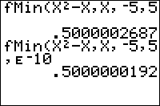

           
|Command Summary|Command Syntax|[Calculator Compatibility](compatibility.html)|[Token Size](tokens.html)|
|--- |--- |--- |--- |
|Calculates the local minimum of a function.|fMin(*f*(*var*),*var*,*lo*,*hi*[,*tol*])|TI-83/84/+/SE|1 byte|

### Menu Location
While editing a program, press:
1. MATH to open the [math](math.html) menu
1. 6 or use arrow keys to select
       
# The fMin( Command

`fMin(*f*(*var*),*var*,*lo*,*hi*[,*tol*])` finds the value of *var* between *lo* and *hi* at which the minimum of *f*(*var*) occurs. *tol* controls the accuracy of the minimum value computed. The default value of *tol* is 10<sup>-5</sup>.

`fMin(` only works for real numbers and expressions. Brent's method for optimization is used for approximating the minimum value.

```
fMin(cos(sin(X)+Xcos(X)),X,0,2)
		1.076873875
```

Keep in mind that the result is the value of *var*, and not the value of *f(var)*. In this example, 1.076873875 is not the lowest possible value of cos(sin(X)+Xcos(X)), but rather the X-value at which cos(sin(X)+Xcos(X)) is the lowest.

## Advanced Uses

`fMin(` is sometimes useful in finding so-called "multiple roots" of a function. If the graph of your function appears "flat" near the root, `fMin(` might be able to find the value of the root more accurately than [`solve(`](solve.html).


## Error Conditions

- **[ERR:BOUND](errors.html#bound)** is thrown if the lower bound is greater than the upper bound.
- **[ERR:DOMAIN](errors.html#domain)** is thrown if *tol* is 0.
- **[ERR:TOL NOT MET](errors.html#tolnotmet)** is thrown if the tolerance is too small for this specific function.

## Related Commands

- [`fMax(`](fmax.html)
- [`fnInt(`](fnint.html)
- [`nDeriv(`](nderiv.html)
- [`solve(`](solve.html)
