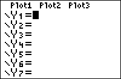

           
|Command Summary|Command Syntax|[Calculator Compatibility](compatibility.html)|[Token Size](tokens.html)|
|--- |--- |--- |--- |
|Turns off equations in the Y= editor (all of them, or only the ones specified)|FnOff [*integer*] [,*integer*]|TI-83/84/+/SE|1 byte|

### Menu Location
Press: # VARS to access the variables menu. # RIGHT to access the Y-VARS submenu. # 4 to select On/Off..., or use arrows and ENTER. # 2 to select FnOff, or use arrows and enter.
# The FnOff Command

The `FnOff` command is used to turn off equations in the current [graphing mode](graphing-mode.html). When you turn off an equation, it's still defined, but isn't graphed; you can reverse this with the [`FnOn`](fnon.html) command. To turn functions on and off manually, put your cursor over the = symbol in the equation editor, and press enter.

When `FnOff` is used by itself, it will turn off all defined equations in the current graphing mode. You can also specify which equations to turn off, by writing their numbers after `FnOff`: for example, `FnOff 1` will turn off the first equation, and `FnOff 2,3,4,5` will off turn the second, third, fourth, and fifth. The numbers you give `FnOff` have to be valid equation numbers in the graphing mode. When turning equations on and off in [sequence](seq-mode.html) mode, use 1 for `u`, 2 for `v`, and 3 for `w`.

The most common use for [`FnOn`](fnon.html) and `FnOff` is to disable functions when running a program, so that they won't interfere with what you're doing on the graph screen, then enable them again when you're done.

## Error Conditions

- **[ERR:DOMAIN](errors.html#domain)** is thrown if an equation number isn't valid in the current graphing mode, or at all.

## Related Commands

- [`FnOn`](fnon.html)
- [`PlotsOn`](plotson.html)
- [`PlotsOff`](plotsoff.html)
