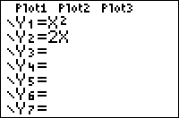

           
|Command Summary|Command Syntax|[Calculator Compatibility](compatibility.html)|[Token Size](tokens.html)|
|--- |--- |--- |--- |
|Turns on equations in the Y= editor (all of them, or only the ones specified)|FnOn [*equation numbers*]|TI-83/84/+/SE|1 byte|

### Menu Location
Press:
1. VARS to access the variables menu.
2. RIGHT to access the Y-VARS submenu.
3. 4 to select On/Off..., or use arrows and ENTER.
4. ENTER to select FnOn.
       
# The FnOn Command

The `FnOn` command is used to turn on equations in the current [graphing mode](graphing-mode.html). When you define an equation, it's turned on by default, but the [`FnOff`](fnoff.html) command can turn an equation off (in which case, it's still defined, but isn't graphed). To turn functions on and off manually, put your cursor over the = symbol in the equation editor, and press enter.

When `FnOn` is used by itself, it will turn on all defined equations in the current graphing mode. You can also specify which equations to turn on, by writing their numbers after `FnOn`: for example, `FnOn 1` will turn off the first equation, and `FnOn 2,3,4,5` will turn the second, third, fourth, and fifth. The numbers you give `FnOn` have to be valid equation numbers in the graphing mode. When turning equations on and off in [sequence](seq-mode.html) mode, use 1 for `u`, 2 for `v`, and 3 for `w`.

The most common use for `FnOn` and [`FnOff`](fnoff.html) is to disable functions when running a program, so that they won't interfere with what you're doing on the graph screen, then enable them again when you're done.

## Error Conditions

- **[ERR:DOMAIN](errors.html#domain)** is thrown if an equation number isn't valid in the current graphing mode, or at all.

## Related Commands

- [`FnOff`](fnoff.html)
- [`PlotsOn`](plotson.html)
- [`PlotsOff`](plotsoff.html)
