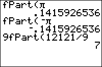

           
|Command Summary|Command Syntax|[Calculator Compatibility](compatibility.html)|[Token Size](tokens.html)|
|--- |--- |--- |--- |
|Returns the fractional part of a value.|fPart(*value*)|TI-83/84/+/SE/CE|1 byte|

### Menu Location
Press:
1. MATH to access the [math](math.html) menu.
1. RIGHT to access the NUM submenu.
1. 4 to select fPart(, or use arrows.
       
# The fPart( Command

`fPart(value)` returns the fractional part of *value*, be it a variable, list, or matrix.
```
fPart(5.32)
             .32
fPart(4/5)
              .8
fPart(‾5.32)
             ‾.32
fPart(‾4/5)
              ‾.8
```

`fPart` is sometimes used with it's corresponding partner [`iPart`](ipart.html). While `iPart` trims off the part *before* the decimal point, `fPart` trims off the part *after* it.

## Watch Out For Precision Issues

```
1/3*3→X   // X is expected to be 1
X         // Displays 1, but is actually 0.99999999999999 in memory
iPart(X)  // Displays 0
fPart(X)  // Displays 1, but is actually 0.99999999999999 in memory
```

Somewhat unintuitively, the code above displays the results 1, 0 and 1. This is due to the calculator storing values to 14 digits of precision, but rounding the value to 10 digits to fit on the home screen. Because of this, `fPart()` can *appear* to return values of `1` or `-1`.

*Tip:* If you enter a value in the list editor screen, you will be able to see all 14 digits of precision. This can help you troubleshoot issues like these.

One workaround is to [round](round.html) the numbers prior to calling `iPart()` or `fPart()`, if you don't mind the slight loss in precision from 14 significant digits to 9 decimal places:

```
1/3*3→X
iPart(round(X,9))   // Displays the expected result 1
fPart(round(X,9))   // Displays the expected result 0
```

(The parameter 9 is not technically required here since 9 is the default, but is shown for clarity and in case you want to customize the level of precision.)

## Advanced Uses

#### Modulus 

`fPart(` is an easy way to find A mod B (the positive remainder when A is divided by B). 

```
B(A<0)+iPart(BfPart(A/B))
```

If A is guaranteed to be positive, the following shorter code can be used, omitting `B(A<0)`:

```
iPart(BfPart(A/B))
```

#### Detect Whole Numbers

The easiest way to check if a number is a whole number is `not(fPart(X`:

```
If not(fPart(X:Then
  // X is an integer
Else
  // X is not an integer
End
```

This can be used, for example, to check if a number is divisible by another: if X is divisible by N, then X/N is a whole number. This is useful for finding the [factors](factorization.html) of a number. 

#### Compression

`fPart(`, along with [`int(`](int.html) or [`iPart(`](ipart.html), can be used for integer [compression](compression.html).

## Related Commands

- [`int(`](int.html)
- [`iPart(`](ipart.html)
- [`round(`](round.html)

## See Also

- [Compression](compression.html)
- [Number Factorization](factorization.html)
