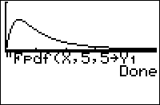

           
|Command Summary|Command Syntax|[Calculator Compatibility](compatibility.html)|[Token Size](tokens.html)|
|--- |--- |--- |--- |
|Evaluates the F-distribution probability density function at a point.|Fpdf(*x*, *numerator df*, *denominator df*)|TI-83/84/+/SE|2 bytes|

### Menu Location
Press:
1. 2ND DISTR to access the distribution menu
2. 8 to select Fpdf(, or use arrows.
Press 9 instead of 8 on a TI-84+/SE with OS 2.30 or higher.
       
# The Fpdf( Command

`Fpdf(` is the *F*-distribution probability density function. 

Since the *F*-distribution is continuous, the value of `Fpdf(` doesn't represent an actual probability - in fact, one of the only uses for this command is to draw a graph of the distribution. You could also use it for various calculus purposes, such as finding inflection points. 

The command takes 3 arguments: *x* is the point at which to evaluate the function (when graphing, use X for this argument), *numerator df* and *denominator df* are the numerator degrees of freedom and denominator degrees of freedom respectively (these specify a single `Fpdf(` curve out of an infinite family).

The *F*-distribution is used mainly in significance tests of variance.

## Formulas

The value of the `Fpdf(` is given by

$$\operatorname{Fpdf}(x,d_1,d_2) = \frac{\left( \frac{d_1x}{d_1x+d_2} \right)^{d_1/2} \left(1-\frac{d_1x}{d_1x+d_2}\right)^{d_2/2}}{x \operatorname{B}(d_1/2,d_2/2)}$$

where *B(x,y)* is the [Beta function](https://en.wikipedia.org/wiki/beta_function).

## Related Commands

- [`Fcdf(`](fcdf.html)
- [`ShadeF(`](shadef.html)
