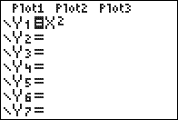

           
|Command Summary|Command Syntax|[Calculator Compatibility](compatibility.html)|[Token Size](tokens.html)|
|--- |--- |--- |--- |
|Enables function graphing mode.|Func|TI-83/84/+/SE/CE|1 byte|

### Menu Location
While editing a program, press:
1. MODE to access the mode menu.
2. Use arrows to select Func.
       
# The Func Command

The `Func` command enables the default [function](graphing-mode.html#function) graphing mode. This command is usually unnecessary in a program, but if you want to graph a Y= equation, you'd want to make sure the calculator is in function mode first.

In function mode, you can graph equations where *y* (the vertical coordinate) is a function of *x* (the horizontal coordinate). This mode is most commonly discussed in algebra and single-variable calculus courses. Many curves, such as a parabola, have simple expressions when written in the form *y=f(x)*.

However, in function mode, many expressions cannot be graphed at all. For example, a circle can't be easily graphed in function mode, since for some *x*-values, there are two *y*-values. Using two functions, you can achieve a circle, but it will still require a friendly graphing window to display perfectly.

Many calculator features are specifically targeted at function mode graphing. For example, two graphing styles (see [`GraphStyle(`](graphstyle.html)) can be only used with function mode. The [`DrawF`](drawf.html) and [`DrawInv`](drawinv.html) commands draw functions as if in graphing mode.

## Advanced Uses

The [window variables](system-variables.html#window) that apply to function mode are:

- `Xmin` — Determines the minimum X-value shown on the screen.
- `Xmax` — Determines the maximum X-value shown on the screen.
- `Xscl` — Determines the horizontal space between marks on the X-axis in [`AxesOn`](axeson.html) mode or dots in [`GridOn`](gridon.html) mode.
- `Ymin` — Determines the minimum Y-value shown on the screen.
- `Ymax` — Determines the maximum Y-value shown on the screen.
- `Yscl` — Determines the vertical space between marks on the Y-axis in `AxesOn` mode or dots in `GridOn` mode.
- `Xres` — Determines the pixel distance between points used for graphing. This is a value 1-8: 1 for best quality, 8 for best speed.

## Related Commands

- [`Param`](param.html)
- [`Polar`](polar-mode.html)
- [`Seq`](seq-mode.html)
