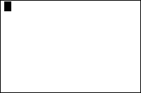

           
|Command Summary|Command Syntax|[Calculator Compatibility](compatibility.html)|[Token Size](tokens.html)|
|--- |--- |--- |--- |
|Sets the screen mode to G-T.|G-T|TI-83/84/+/SE|2 bytes|

### Menu Location
In the program editor,<br># Press [MODE] for the mode menu<br># Press [DOWN] seven times (for the split screen commands) <br># Press [RIGHT] twice to select G-T<br># Press [ENTER] to insert it<br>This command can be used on the home screen, but must be selected from the catalog.
# The G-T Command

`G-T` puts the calculator into "Graph-Table" mode: this mode shows the home screen at full size, but the graph screen and table will be displayed together, each taking up half the screen (divided vertically).

`G-T` is usually used at the beginning of a program to ensure that the screen mode is `G-T` , for programs such as math programs that want to demonstrate the thinking step-by-step.

```
:G-T
```

With OS version 2.30 (on the TI-84+ and TI-84+ SE calculators), `G-T` mode can be used with stat plots as well.

## Related Commands

- [`Full`](full.html)
- [`Horiz`](horiz.html)
