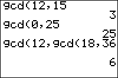

           
|Command Summary|Command Syntax|[Calculator Compatibility](compatibility.html)|[Token Size](tokens.html)|
|--- |--- |--- |--- |
|Finds the greatest common divisor of two values.|gcd(*value1*, *value2*)|TI-83/84/+/SE|2 bytes|

### Menu Location
Press:
1. MATH to access the [math](math.html) menu.
1. RIGHT to access the NUM submenu.
1. 9 to select gcd(, or use arrows.
       
# The gcd( Command

The `gcd(` command returns the [greatest common divisor](https://en.wikipedia.org/wiki/greatest_common_divisor) (GCD) of two nonnegative integers. It also works on lists.
```
gcd(8,6)
     2
gcd({9,12},6)
     {3 6}
gcd({14,12},{6,8})
     {2 4}
```

## Advanced Uses

A `gcd(` command can be nested inside another `gcd(` command to compare up to four numbers.

## Error Conditions

- **[ERR:DIM MISMATCH](errors.html#dimmismatch)** is thrown if the arguments are two lists that don't have the same number of elements.
- **[ERR:DOMAIN](errors.html#domain)** is thrown if the arguments aren't positive integers (or lists of positive integers) less than `1E12`.

## Related Commands

- [`lcm(`](lcm.html)

## See Also

- [Extended Euclidean Algorithm](extended-euclidean-algorithm.html)
