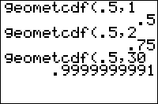

           
|Command Summary|Command Syntax|[Calculator Compatibility](compatibility.html)|[Token Size](tokens.html)|
|--- |--- |--- |--- |
|Calculates the cumulative geometric probability for a single value|geometcdf(*probability*, *trials*)|TI-83/84/+/SE/CSE/+CE|2 bytes|

### Menu Location
Press:
1. 2ND DISTR to access the distribution menu
1. ALPHA E to select geometcdf(, or use arrows.
Press ALPHA F instead of ALPHA E on a TI-84+/SE with OS 2.30 or higher.
       
# The geometcdf( Command

This command is used to calculate cumulative geometric probability. In plainer language, it solves a specific type of often-encountered probability problem, that occurs under the following conditions:
1. A specific event has only two outcomes, which we will call "success" and "failure"
1. The event is going to keep happening until a success occurs
1. Success or failure is determined randomly with the same probability of success each time the event occurs
1. We're interested in the probability that it takes **at most** a specific amount of trials to get a success.

For example, consider a basketball player that always makes a shot with 1/4 probability. He will keep throwing the ball until he makes a shot. What is the probability that it takes him no more than 4 shots?

1. The event here is throwing the ball. A "success", obviously, is making the shot, and a "failure" is missing.
1. The event is going to happen until he makes the shot: a success.
1. The probability of a success - making a shot - is 1/4
1. We're interested in the probability that it takes at most 4 trials to get a success
 
The syntax here is `geometcdf(*probability*, *trials*)`. In this case:
```
:geometcdf(1/4,4
```
This will give about .684 when you run it, so there's a .684 probability that he'll make a shot within 4 throws.

Note the relationship between [`geometpdf(`](geometpdf.html) and `geometcdf(`. Since `geometpdf(` is the probability it will take **exactly** N trials, we can write that `geometcdf(1/4,4) = geometpdf(1/4,1) + geometpdf(1/4,2) + geometpdf(1/4,3) + geometpdf(1/4,4)`.

## Formulas

Going off of the relationship between `geometpdf(` and `geometcdf(`, we can write a formula for `geometcdf(` in terms of `geometpdf(`:

$$
\operatorname{geometcdf}(p,n) = \sum_{i=1}^{n} \operatorname{geometpdf}(p,i) = \sum_{i=1}^{n} p\,(1-p)^{i-1}$$

(If you're unfamiliar with sigma notation, $\sum_{i=1}^{n}$ just means "add up the following for all values of i from 1 to n")

However, we can take a shortcut to arrive at a much simpler expression for `geometcdf(`. Consider the opposite probability to the one we're interested in, the probability that it will **not** take "at most N trials", that is, the probability that it will take more than N trials. This means that the first N trials are failures. So `geometcdf(p,N)` = (1 - "probability that the first N trials are failures"), or:

$$
\operatorname{geometcdf}(p,n) = 1-(1-p)^n$$

## Related Commands

- [`binompdf(`](binompdf.html)
- [`binomcdf(`](binomcdf.html)
- [`geometpdf(`](geometpdf.html)
