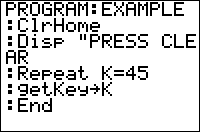

           
|Command Summary|Command Syntax|[Calculator Compatibility](compatibility.html)|[Token Size](tokens.html)|
|--- |--- |--- |--- |
|Returns the numerical code of the last key pressed, or 0 if no key is pressed.|getKey[→*Variable*]|TI-83/84/+/SE|1 byte|

### Menu Location
While editing a program, press:<br># PRGM to enter the PRGM menu<br># RIGHT to enter the I/O menu<br># 7 to choose getKey or use arrows
# The getKey Command

The `getKey` command returns the value of the last key pressed since the last time `getKey` was executed. Reading key presses with `getKey` allows a program to transfer control to the user, and you can combine `getKey` with other commands to create [menus](custommenus.html), [movement](movement.html), or whatever else you want.

Every key has a number assigned to it, except for ON (which is used for breaking out of programs). The numbering system consists of a row and column: the rows go from one to ten, starting at the top; and the columns go from one to six, starting from the left. You just put the row and column together to get the key's number — for example, the ENTER key is located in row 10, column 5, making its value 105. The arrow keys look like they would be numbered separately from the other keys, but they actually follow this pattern as well. See the [key codes](key-codes.html) page for a picture of the key codes on the calculator.

The value of `getKey` is cleared every time you read from it, until a new key is pressed. For this reason, except in very rare cases, you do not want to use the value of `getKey` in an expression directly, but store it to a [variable](variables.html) first. It is also common to use `getKey` inside of a [`Repeat`](repeat.html) loop, so that the program can wait for the user to press a key.
```
:Repeat Ans
:getKey
:End
:Ans→K
```

## Advanced Uses

You can put `getKey` in the condition of a loop, to make the loop repeat until any key or a particular key is pressed by the user. The same thing can be done with conditionals as well. This is useful if you don't want to store `getKey` to a variable, but you still want to have the user press a key. This works because of the way 'true' and 'false' get interpreted in TI-Basic.

```
:Repeat max(getKey={24,25,26,34
:End
```

------

Unlike the other keys, the arrow and DEL keys can actually be held down, which will cause the key to keep being repeated until it is unpressed. This functionality is very useful in games where the user needs to repeatedly press a key to move or shoot, although it does completely disable the other keys from being able to be pressed (which is important in multiplayer games, where everybody must share the keys).

------

Sometimes your program may do something for several seconds without user input (say, playing an [animation](animation.html)), then pause and wait for a key to be pressed. The problem is that if a key is pressed during the animation, the next `getKey` will return the value of that key, and any loop set up to wait for a key press will exit immediately. The solution is to run a "dummy" `getKey` just before the loop begins — its value won't be used for anything, and it will reset the value of `getKey` to 0. This can also be used to clear keypresses meant for loading programs from inside a [shell](asmshells.html).

## Error Conditions

- **[ERR:INVALID](errors.html#invalid)** occurs if this statement is used outside a program.

## Related Commands

- [`Input`](input.html)
- [`Prompt`](prompt.html)

## See Also

- [Key Codes](key-codes.html)
- [Custom Menus](custommenus.html)
- [Movement in Maps](movement.html)
