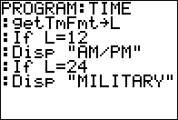

           
|Command Summary|Command Syntax|[Calculator Compatibility](compatibility.html)|[Token Size](tokens.html)|
|--- |--- |--- |--- |
|Returns the time format of the clock on the TI-84+/SE/CE.|getTmFmt→*Variable*|TI-84+/SE/CE|2 bytes|

### Menu Location
This command can only be found in the catalog. Press:
1. 2nd CATALOG to enter the command catalog
1. g to skip to commands starting with G
1. Scroll down to getTmFmt( and select it
       
# The getTmFmt Command

The `getTmFmt(` command returns the current time format of the clock on the TI-84+/SE/CE calculators as an integer. There are two different time formats available: 12 (12 hour) and 24 (24 hours). You can store this value to a [variable](variables.html) for later use. Of course, this command only works if the time format has actually been set, so you should use the [`setTmFmt(`](settmfmt.html) command before using it.

## Related Commands

- [`getTime`](gettime.html)
- [`setTime(`](settime.html)
- [`setTmFmt(`](settmfmt.html)
- [`getTmStr(`](gettmstr.html)
