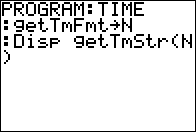

           
|Command Summary|Command Syntax|[Calculator Compatibility](compatibility.html)|[Token Size](tokens.html)|
|--- |--- |--- |--- |
|Returns the current time of the clock on the TI-84+/SE as a string.|getTmStr(*value*)→*variable*|TI-84+/SE|2 bytes|

### Menu Location
This command can only be found in the catalog. Press:
1. 2nd CATALOG to enter the command catalog
1. g to skip to commands starting with G
1. Scroll down to getTmStr( and select it
       
# The getTmStr( Command

The getTmStr( command returns the current time of the clock on the TI-84+/SE calculators as a string based on the time format that is specified. There are two different time formats available: 12 (12 hour) or 24 (24 hour). You can store this value to a [string](strings.html) variable for later use, or manipulate it the same way you do with other strings. Of course, this command only works if the time format has actually been set, so you should use the [setTmFmt(](settmfmt.html) command before using it.

## Related Commands

- [getTime](gettime.html)
- [getTmFmt](gettmfmt.html)
- [setTime(](settime.html)
- [setTmFmt(](settmfmt.html)
