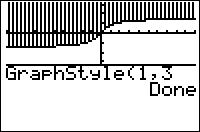

           
|Command Summary|Command Syntax|[Calculator Compatibility](compatibility.html)|[Token Size](tokens.html)|
|--- |--- |--- |--- |
|Sets the graphing style of a graphing equation in the current mode.|GraphStyle(*equation #*, *style #*)|TI-83/84/+/SE/CE|2 bytes|

### Menu Location
While editing a program, press: # PRGM to access the programming menu. # ALPHA H to select GraphStyle(, or use arrows.
# The GraphStyle( Command

The `GraphStyle(` command allows you to set the graphing style of an equation (line, thick line, dotted line, etc.) from within a program.

Its first argument, *equation #*, is the number of the equation whose graphing style you want to change - this depends on the mode you're in. For example, if you wanted to change the graphing style of Y1,  you would need to be in [function](func.html) mode and use the value 1 for this argument. If you wanted to change the graphing style of r4, you would need to be in [polar](polar-mode.html) mode and use the value 4.

The second argument is a number from 1 to 7, which translates to a graphing style as follows:
- 1 - a normal line, usually the default graph style.
- 2 - a thick line (three pixels wide).
- 3 - a line, with everything above it shaded (only valid in function mode).
- 4 - a line, with everything below it shaded (only valid in function mode).
- 5 - a path: a line, with a ball moving along it as it is graphed (not valid in [sequential](seq-mode.html) mode).
- 6 - animated: a ball moving along the graph (not valid in sequential mode).
- 7 - a dotted line.

Compare this to the effect of [`Connected`](connected.html) or [`Dot`](dot.html) mode. When either of these modes is set, all equations, from all graphing modes, are reverted to line style or dotted line style respectively; furthermore, it becomes the default graph style and clearing an equation will revert it to this graph style. The `GraphStyle(` command simply overrides these modes temporarily.

## Advanced

In shading modes (3 and 4), the shading style cycles as follows:
- The first function graphed shades using vertical lines one pixel apart
- The second function shades using horizontal lines one pixel apart
- The third function shades using negatively sloping diagonal lines, two pixels apart.
- The fourth function shades using positively sloping diagonal lines, two pixels apart.
- After that, functions will cycle through these four styles in that order.

## Error Conditions

- **[ERR:DOMAIN](errors.html#domain)** if the *equation #* is not a valid equation number in this mode, or if *style #* is not an integer 1-7.
- **[ERR:INVALID](errors.html#invalid)** if the graphing style chosen is not valid for the current graphing mode.

## Related Commands

- [`FnOn`](fnon.html)
- [`FnOff`](fnoff.html)
- [`Connected`](connected.html)
- [`Dot`](dot.html)
