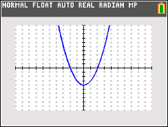

           
|Command Summary|Command Syntax|[Calculator Compatibility](compatibility.html)|[Token Size](tokens.html)|
|--- |--- |--- |--- |
|Enables a grid of colored dots on the graph screen|GridDot [*color#*]|TI-84+ CSE/CE|2 bytes|

### Menu Location
Press:
1. 2nd FORMAT to access the graph format menu.
1. Use arrows and ENTER to select GridDot.
       
# The GridDot Command

The `GridDot` command enables a grid of dots on the graph screen (you can disable it with the [`GridOff`](gridoff.html) command). How fine or coarse the grid is depends on the [`Xscl`](system-variables.html#window) and [`Yscl`](system-variables.html#window) variables. Drawing the grid just involves plotting points all the points of the form (A×`Xscl`, B×`Yscl`) that are in the graphing window. The grid can be any colored defined by a color variable or value.

```
:GridDot BLUE    //creates a grid of blue dots
:GridDot 12       //creates a grid of black dots
```

## Related Commands

- [GridOn](gridon.html)
- [GridOff](gridoff.html)
- [GridLine](gridline.html)
- [AxesOn](axeson.html)
- [AxesOff](axesoff.html)
