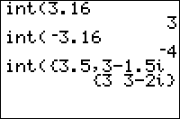

           
|Command Summary|Command Syntax|[Calculator Compatibility](compatibility.html)|[Token Size](tokens.html)|
|--- |--- |--- |--- |
|Rounds a value down to the nearest integer.|int(*value*)|TI-83/84/+/SE/CE|1 byte|

### Menu Location
Press:
1. MATH to access the [math](math.html) menu.
2. RIGHT to access the NUM submenu.
3. 5 to select int(, or use arrows.
       
# The int( Command

`int(X)` is the [floor function](http://mathworld.wolfram.com/floorfunction.html). It returns the greatest integer less than or equal to *X*, and also works on complex numbers, lists and matrices.

```
int(5.32)
               5
int(4/5)
               0
int(‾5.32)
               ‾6
int(‾4/5)
               ‾1
```

The difference between [`iPart(`](ipart.html) and `int(` is subtle, and many people aren't even aware of it, but it exists. Whereas `iPart(` always truncates its parameters, simply removing the fractional part, `int(` always rounds down. This means that they return the same answers for positive numbers, but `int(` will return an answer 1 less than `iPart(` for (non-integer) negative numbers. For example, `iPart(-5.32)` is -5, while `int(-5.32)` is -6.

Most of the time, however, you're dealing with only positive numbers anyway. In this case, the decision to use `iPart(` or `int(` is mostly a matter of preference - some people use `int(` because it is shorter; some use `iPart(` when there is a corresponding [`fPart(`](fpart.html) taken. However, if speed is a consideration, one should check the Command Timings section.

## Advanced Uses

`int(`, along with [`iPart(`](ipart.html) and [`fPart(`](fpart.html), can be used for integer [compression](compression.html).

## Command Timings

The following table compares the speeds of `int(` and `iPart(`. Each command was timed over 2000 iterations to find a noticeable difference.

| Format | Bars | Pixels | Total |
| --- | --- | --- | --- |
| iPart(1 | 10 | 1 | 81 |
| iPart(1.643759 | 10 | 1 | 81 |
| int(1 | 8 | 7 | 71 |
| int(1.643759 | 10 | 2 | 82 |

Conclusion: `int(` scales with the length of its input while `iPart(` does not. For fewer than 6 decimals, `int(` will most often be faster; for 6 or more decimals, consider using `iPart(`.

## Related Commands

- [`iPart(`](ipart.html)
- [`fPart(`](fpart.html)
- [`round(`](round.html)

## See Also

- [Compression](compression.html)
