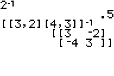

           
|Command Summary|Command Syntax|[Calculator Compatibility](compatibility.html)|[Token Size](tokens.html)|
|--- |--- |--- |--- |
|Returns the reciprocal of a number (1 divided by the number). For matrices, finds the matrix inverse.|*value*ֿ¹|TI-83/84/+/SE|1 byte|

### Menu Location
Press [*x*ֿ¹]
       
# The ֿ¹ Command

The ֿ¹ command returns the reciprocal of a number, equivalent to dividing 1 by the number (although reciprocals are sometimes more convenient to type). It also works for lists, by calculating the reciprocal of each element. 

The ֿ¹ command can also be used on matrices, but it is the matrix inverse that is computed, not the reciprocal of each element. If [A] is an N by N (square) matrix, then [A]ֿ¹ is the N by N matrix such that [A][A]ֿ¹=[A]ֿ¹[A] is the identity matrix. ֿ¹ does not work on non-square matrices.

```
4ֿ¹
		.25
{1,2,3}ֿ¹
		{1 .5 .3333333333}
[[3,2][4,3]]ֿ¹
		[[3  -2]
		 [-4 3 ]]
```

Much like the number 0 does not have a reciprocal, some square matrices do not have inverses (they are called singular matrices) and you'll get an error when you try to invert them.

## Optimization

Writing Aֿ¹B instead of B/A is sometimes beneficial when B is a complicated expression, because it allows you to take off closing parentheses of B. For example:

```
:(P+√(P²-4Q))/2
can be
:2ֿ¹(P+√(P²-4Q
```

This may be slower than dividing. There are also situations in which this optimization might lose precision, especially when the number being divided is large:

```
7fPart(4292/7
		1
7fPart(7ֿ¹4292
		.9999999999
```

## Error Conditions

- **[ERR:DIVIDE BY 0](errors.html#divideby0)** is thrown when trying to take the reciprocal of 0.
- **[ERR:SINGULAR MAT](errors.html#singularmat)** is thrown when trying to invert a singular matrix.

## Related Commands

- [²](2.html)
- [³](3.html)
