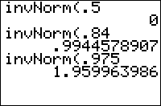

           
|Command Summary|Command Syntax|[Calculator Compatibility](compatibility.html)|[Token Size](tokens.html)|
|--- |--- |--- |--- |
|Calculates the inverse of the cumulative normal distribution function.|invNorm(*probability*[,*μ*, *σ*])|TI-83/84/+/SE|2 bytes|

### Menu Location
Press:
1. 2ND DISTR to access the distribution menu
2. 3 to select invNorm(, or use arrows.
       
# The invNorm( Command

`invNorm(` is the inverse of the cumulative normal distribution function: given a probability, it will give you a z-score with that tail probability. The probability argument of `invNorm(` is between 0 and 1; 0 will give `-1E99` instead of negative infinity, and 1 will give `1E99` instead of positive infinity

There are two ways to use `invNorm(`. With three arguments, the inverse of the cumulative normal distribution for a probability with specified mean and standard deviation is calculated. With one argument, the standard normal distribution is assumed (zero mean and unit standard deviation). For example:

```
for the standard normal distribution
:invNorm(.975

for the normal distribution with mean 10 and std. dev. 2.5
:invNorm(.975,10,2.5
```

## Advanced

This is the only inverse of a probability distribution function available (at least on the TI-83/84/+/SE calculators), so it makes sense to use it as an approximation for other distributions. Since the normal distribution is a good approximation for a binomial distribution with many trials, we can use `invNorm(` as an approximation for the nonexistent "invBinom(". The following code gives the number of trials out of `N` that will succeed with probability `X` if the probability of any trial succeeding is `P` (rounded to the nearest whole number):

```
:int(.5+invNorm(X,NP,√(NP(1-P
```

You can also use `invNorm()` to approximate the [inverse of a t-distribution](invt.html). Since a normal distribution is a t-distribution with infinite degrees of freedom, this will be an overestimate for probabilities below 1/2, and an underestimate for probabilities above 1/2.

## Formulas

Unlike the [`normalpdf(`](normalpdf.html) and [`normalcdf(`](normalcdf.html) commands, the `invNorm(` command does not have a closed-form formula. It can however be expressed in terms of the [inverse error function](https://en.wikipedia.org/wiki/error_function):
$$ \operatorname{invNorm}(p) = \sqrt{2}\,\operatorname{erf}^{-1}(2p-1) $$

For the arbitrary normal distribution with mean μ and standard deviation σ:
$$ \operatorname{invNorm}(p,\mu,\sigma)=\mu+\sigma\operatorname{invNorm}(p) $$

## Related Commands

- [`normalpdf(`](normalpdf.html)
- [`normalcdf(`](normalcdf.html)
- [`ShadeNorm(`](shadenorm.html)
