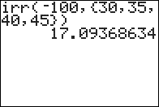

           
|Command Summary|Command Syntax|[Calculator Compatibility](compatibility.html)|[Token Size](tokens.html)|
|--- |--- |--- |--- |
|Calculates the [Internal Rate of Return](https://en.wikipedia.org/wiki/internal_rate_of_return) of an investment.|irr(*CF0*,*CFList*,[*freq*])|TI-83/84/+/SE|2 bytes|

### Menu Location
On the TI-83, press:
1. 2nd FINANCE to access the finance menu.
1. 8 to select irr(, or use arrows and ENTER.

On the TI-83+ or higher, press:
1. APPS to access the applications menu.
1. 1 or ENTER to select Finance...
1. 8 to select irr(, or use arrows and ENTER.
       
# The irr( Command

The `irr(` command finds the [Internal Rate of Return](https://en.wikipedia.org/wiki/internal_rate_of_return) of an investment, which is a measure of its efficiency. Its mathematical interpretation is the interest rate for which [`npv(`](npv.html) will return 0 for the same cash flows.

`irr(` takes three arguments: an initial cash flow (CF0), a list of further cash flows (CFList), and an optional frequency list.

## Advanced Uses

`irr(` can be used to find a root of a polynomial of any degree, give by a list of its coefficients:
```
1+.01irr(0,{list of coefficients})
```
However, this method is limited to finding roots greater than 0, and will throw an error ([ERR:NO SIGN CHG](errors.html#nosignchg) or [ERR:DIVIDE BY 0](errors.html#divideby0)) if it can't find such roots. By reversing the list of coefficients and taking the reciprocal of the roots found, you could find roots less than 0, but this would still result in errors if such roots don't exist either.

Using [`solve(`](solve.html) to find roots of polynomials is less efficient, but more reliable, since it doesn't throw an error unless there are no roots at all to be found.

## Formulas

Solving for `irr(` requires solving a polynomial with degree equal to the total number of cash flows. As such, there is no general formula for calculating `irr(`, though numerical methods are possible for finding an approximate solution.

The polynomial associated with the calculation is:

$$\sum_{i=0}^{N}{C_i\left(1+\frac{\mathrm{Irr}}{100}\right)^{N-i}}=0$$

Here, Irr is the internal rate of return, N is the number of cash flows, and C<sub>t</sub> is the t <sup>th</sup> cash flow. 

To the calculator, only roots for which Irr>0 are considered to be viable.

## Error Conditions

- **[ERR:DIM MISMATCH](errors.html#dimmismatch)** is thrown if the frequency list's size doesn't match the cash flow list's size.
- **[ERR:DIVIDE BY 0](errors.html#divideby0)** is thrown if the solution that is found is Irr=0.
- **[ERR:NO SIGN CHG](errors.html#nosignchg)** is thrown if no positive real solution is found.

## Related Commands

- [`npv(`](npv.html)
