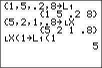

           
|Command Summary|Command Syntax|[Calculator Compatibility](compatibility.html)|[Token Size](tokens.html)|
|--- |--- |--- |--- |
|Indicates the beginning of a custom list.|∟*LISTNAME*|TI-83/84/+/SE|1 byte|

### Menu Location
While editing a program, press:
1. 2nd LIST to access the List menu
2. RIGHT to access the OPS submenu
3. 2nd B to select ∟, or use arrows
       
# The ∟ Command

The ∟ character is used at the start of the name of any custom list you create, for example:

```
{1,2,3}→∟HELLO
{4,5,6}→∟WORLD
```

In most cases you need to include this when accessing or manipulating a custom list (although there's a few exceptions, see the *Optimization* section below). You do not need this character when accessing the the default lists `L₁`...`L₆`). 

The maximum length of the list name (not including the `∟`) is five letters. `∟ABCDE` works, but `∟ABCDEF` does not. List names must start with a letter A-Z but can also include numbers so `∟LIST1` and `∟LIST2` are valid list names, but `∟123` is not.

There are two ways to insert this character:

1. Press `2nd`, `LIST`, press right arrow to access the `OPS` menu, scroll to the bottom, and press `ENTER` to insert the `∟` character. You can then type the rest of the name of your list.
2. If your custom list already exists, you can press `2nd`, `LIST`, select the name of your list, and press `ENTER`. The whole name including the `∟` character will be inserted.


## Optimization

You don't actually need to include the ∟ command when [storing](store.html) (→) to a list. 

```
{1,2,3}→HELLO
{4,5,6}→WORLD
{7,8,9}→X
```

Although the name `X` as used above also matches the name of a regular real variable, since the data being stored is a list, it will be saved to `∟X`.

When storing to a specific *list item*, you MUST still include the `∟` character:

```
1→∟HELLO(1)
2→∟WORLD(2)
3→∟X(3)
```

Some of the list commands also allow for leaving off the `∟` character, such as [`SetUpEditor`](setupeditor.html). However, *be careful* when doing so with [`Input`](input.html) and [`Prompt`](prompt.html) because you might only be asking the user to input a list, but if a real value is entered, it would be saved to a real variable instead.

## Error Conditions

- **[ERR:SYNTAX](errors.html#syntax)** is thrown if you try to reference/create a list with more than 5 characters in its name.
- **[ERR:UNDEFINED](errors.html#undefined)** is thrown if you try to use ∟ on an undefined list.

## Related Commands

- [→](store.html) (store)
