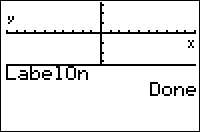

           
|Command Summary|Command Syntax|[Calculator Compatibility](compatibility.html)|[Token Size](tokens.html)|
|--- |--- |--- |--- |
|Puts labels on the X and Y coordinate axes.|LabelOn|TI-83/84/+/SE|2 bytes|

### Menu Location
Press:
1. 2nd FORMAT to access the format menu.
2. Use arrows and ENTER to select LabelOn.
       
# The LabelOn Command

The `LabelOn` setting enables labels on the X and Y coordinate axes. If both `LabelOn`and [`AxesOn`](axeson.html) are set, the axes will be displayed with an X next to the X (horizontal) axis, and a Y next to the Y (vertical) axis. To disable these labels, use the [`LabelOff`](labeloff.html) setting.

`LabelOn` and `LabelOff` have no effect if the coordinate axes aren't displayed; there's nothing to label.

A somewhat quirky behavior of the X and Y labels is that they aren't saved by [`StorePic`](storepic.html). If you save a picture of the graph screen, it records every detail of the way it looks, including equations, drawn elements, axes, grid, everything — but not the labels.

One final comment: okay, so by the way the command works we know it was once *intended* to label the axes. However, the command doesn't actually check where the axes *are*. It puts an "x" slightly above the bottom right corner, and a "y" slightly below the top left. Most of the time, including the default graphing window, that doesn't help you to distinguish the axes in the slightest. And in split-screen mode, as shown in the screenshot, they both seem to label the x-axis. Weird.

## Related Commands

- [LabelOff](labeloff.html)
- [AxesOn](axeson.html)
- [AxesOff](axesoff.html)
