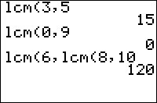

           
|Command Summary|Command Syntax|[Calculator Compatibility](compatibility.html)|[Token Size](tokens.html)|
|--- |--- |--- |--- |
|Finds the least common multiple of two values.|lcm(*value1*, *value2*)|TI-83/84/+/SE|2 bytes|

### Menu Location
Press:
1. MATH to access the [math](math.html) menu.
2. RIGHT to access the NUM submenu.
3. 8 to select lcm(, or use arrows.
       
# The lcm( Command

Returns the least common multiple (LCM) of two nonnegative integers; lcm(*a*,*b*) is equivalent to *a**b*/gcd(*a*,*b*). Also works on lists.
```
lcm(8,6)
     24
lcm({9,12},6)
     {18 12}
lcm({14,12},{6,8})
     {42 24}
```

## Error Conditions

- **[ERR:DIM MISMATCH](errors.html#dimmismatch)** is thrown if the arguments are two lists that don't have the same number of elements.
- **[ERR:DOMAIN](errors.html#domain)** is thrown if the arguments aren't positive integers (or lists of positive integers) less than 1e12.

## Related Commands

- [gcd(](gcd.html)
