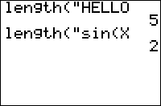

           
|Command Summary|Command Syntax|[Calculator Compatibility](compatibility.html)|[Token Size](tokens.html)|
|--- |--- |--- |--- |
|Returns the length of a string.|length(*string*)|TI-83/84/+/SE|2 bytes|

### Menu Location
This command can only be found in the catalog. Press:<br># 2nd CATALOG to access the command catalog<br># L to skip to commands starting with L<br># scroll down to length( and select it
# The length( Command

This command is used to determine the length of a string. Unlike the [dim(](dim.html) command for lists and matrices, it cannot be used to change this length, as there is no null character for strings (the null value is 0 for lists and matrices).

```
:length("HELLO
	5
```

Keep in mind that the length is measured in the number of tokens, and not the number of letters in the string. For example, although the sin( command contains 4 characters ("s", "i", "n", and "("), it will only add 1 to the total length of a string it's in. The execution time for length( is directly proportional to the length of the string.

## Advanced Uses

The code for looping over each character (technically, each token) of a string involves length(:

```
:For(N,1,length(Str1
...
use sub(Str1,N,1 for the Nth character
...
:End
```

## Related Commands

- [expr(](expr.html)
- [inString(](instring.html)
- [sub(](sub.html)
