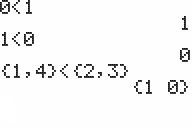

           
|Command Summary|Command Syntax|[Calculator Compatibility](compatibility.html)|[Token Size](tokens.html)|
|--- |--- |--- |--- |
|Returns true if value1 is less than value2.|*value1*<*value2*|TI-83/84/+/SE|1 byte|

### Menu Location
Press:
1. 2nd TEST to access the test menu.
1. 5 to select <, or use arrows.
       
# The < Command

The < (less than) operator takes two numbers, variables, or expressions, and tests to see if the first one has a value less than the second one. It will return 1 if it is less than, and 0 if it is not. When determining the order of operations, < will be executed after the [math](operators.html#math) operators, but it will be executed before the [logical](operators.html#logical) operators and in the order that it appears from left to right with the other [relational](operators.html#relational) operators.

```
:1<0
           0

:DelVar X3→Y
:X<Y
           1
```

## Advanced Uses

Just like the other relational operators, < can take real numbers and lists for variables. In order to compare the lists, however, both must have the same dimensions; if they don't, the calculator will throw a [ERR:DIM MISMATCH](errors.html#dimmismatch) error. When comparing a real number to a list, the calculator will actually compare the number against each element in the list and return a list of 1s and 0s accordingly.

```
:{2,4,6,8}<{1,3,5,7
           {0 0 0 0}
:5<{1,2,3,4,5
           {0 0 0 0 0}
```

Unfortunately, < does not work with strings, matrices, or complex numbers (only [=](equal.html) and [≠](notequal.html) do), and the calculator will actually throw a [ERR:DATA TYPE](errors.html#datatype) error if you try to compare them. In the case of strings, however, it should be pretty obvious why: a string represents a sequence of characters, and does not associate a value to any character, so there is nothing to compare.

## Error Conditions

- **[ERR:DATA TYPE](errors.html#datatype)** is thrown if you try to compare strings, matrices, or complex numbers.
- **[ERR:DIM MISMATCH](errors.html#dimmismatch)** is thrown if you try to compare two lists that have different dimensions.

## Related Commands

- [=](equal.html) (equal)
- [≠](notequal.html) (not equal)
- [>](greaterthan.html) (greater than)
- [≥](greaterthanequal.html) (greater than equal)
- [≤](lessthanequal.html) (less than equal)
