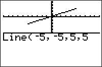

           
|Command Summary|Command Syntax|[Calculator Compatibility](compatibility.html)|[Token Size](tokens.html)|
|--- |--- |--- |--- |
|Draws a line at any angle.|Line(X<sub>1</sub>,Y<sub>1</sub>,X<sub>2</sub>,Y<sub>2</sub>*[,erase,color,style]*)|TI-83/84/+/SE|1 byte|

### Menu Location
Press:
1. 2nd DRAW to enter the draw menu
1. 2 to insert the Line( token, or use arrows and ENTER.
       
# The Line( Command

The Line( command is used to draw lines at any angle, as opposed to only drawing [vertical](vertical.html) or [horizontal](horizontal.html) lines. Line(X<sub>1</sub>,Y<sub>1</sub>,X<sub>2</sub>,Y<sub>2</sub>) will draw a line from (X<sub>1</sub>,Y<sub>1</sub>) to (X<sub>2</sub>,Y<sub>2</sub>). Line( is affected by the window settings, although you can use a [friendly window](friendly-window.html) so there is no impact on the command.

```
:Line(5,5,20,3)
```

## Advanced Uses

Line has an optional fifth argument. It can be any real number, but the default is one. If the fifth argument, *erase*, is something other than 0, then it will simply draw the line. If *erase* is 0, then it will erase the line.

```
:Line(5,5,20,3,0)
```

Leave off the ending argument if you are just drawing the line.

```
:Line(5,5,20,3,1)
can be
:Line(5,5,20,3)
```

The ending argument can be a formula, which is useful for [movement applications](movement.html) and other things such as health bars where the lines drawn are constantly different. The following draws or erases a line depending on whether a key is pressed.

```
:getKey
:Line(5,5,20,3,not(Ans
```

If working on a TI 84+CSE or TI 84+CE, then the fifth argument of the Line( command can be a color name or ID number:

```
:Line(5,5,20,3,BROWN
```


The last argument, line style, is an optional argument that chooses what style of line to draw on the color calculators.

```
1 pixel wide line
:Line(5,5,20,3,RED,1
2 pixel wide line
:Line(5,5,20,3,RED,2
shaded above
:Line(5,5,20,3,RED,3
shaded below
:Line(5,5,20,3,RED,4
```

## Command Timings

If you are drawing horizontal or vertical lines that stretch the entire graph screen, such as a border, it is better to use [Vertical](vertical.html) or [Horizontal](horizontal.html). These are smaller and are usually faster as well.

## Related Commands

- [Vertical](vertical.html)
- [Horizontal](horizontal.html)

## See Also

- [Friendly Graphing Window](friendly-window.html)
