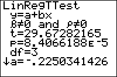

           
|Command Summary|Command Syntax|[Calculator Compatibility](compatibility.html)|[Token Size](tokens.html)|
|--- |--- |--- |--- |
|Calculates the best fit line through a set of points, then uses a significance test on the slope of the line.|LinRegTTest [*x-list*, *y-list*, [*frequency*], [*alternative*], [*equation*]|TI-83/84/+/SE|2 bytes|

### Menu Location
Press:
1. STAT to access the statistics menu
2. RIGHT to access the TESTS submenu
3. ALPHA E to select LinRegTTest, or use arrows
Change the last keypress to ALPHA F on a TI-84+/SE with OS 2.30 or higher.
       
# The LinRegTTest Command

Like [`LinReg(ax+b)`](linreg(ax-b.html) and similar commands, `LinRegTTest` finds the best fit line through a set of points. However, `LinRegTTest` adds another method of checking the quality of the fit, by performing a [`t-test`](t-test.html) on the slope, testing the null hypothesis that the slope of the true best fit line is 0 (which implies the absence of correlation between the two variables, since a relation with a slope of zero means the x-variable does not affect the y-variable at all). If the p-value of the test is not low enough, then there is not enough data to assume a linear relation between the variables.

To use `LinRegTTest`, you must first store the points to two lists: one of the x-coordinates and one of the y-coordinates, ordered so that the nth element of one list matches up with the nth element of the other list. L₁ and L₂ are the default lists to use, and the List Editor (STAT > Edit...) is a useful window for entering the points.

In its simplest form, `LinRegTTest` takes no arguments, and calculates a best fit line through the points in L₁ and L₂:
```
:{9,13,21,30,31,31,34→L₁
:{260,320,420,530,560,550,590→L₂
:LinRegTTest
```
The output will look as follows:
```
LinRegTTest
 y=a+bx
 β≠0 and ρ≠0
 t=53.71561274
 p=4.2285344e-8
 df=5
 a=145.3808831
 b=13.09073265
 s=5.913823968
 r²=.9982701159
 r=.9991346836
```
(the last two lines will only appear if diagnostics have been turned on - see [`DiagnosticOn`](diagnosticon.html))
- β and ρ: this line represents the alternative hypothesis. β is the true value of the statistic b (it is what we would get if the regression was done on the entire population, rather than a sample); ρ is the true value of the statistic r.
- t is the test statistic, used to calculate p.
- p is the probability that we'd get a correlation this strong by chance, assuming the null hypothesis that there is no actual correlation. When it's low, as here, this is evidence against the null hypothesis. Since p<.01, the data is significant on a 1% level, so we reject the null hypothesis and conclude that there is a correlation.
- df is the degrees of freedom, equal to the number of points minus two
- a and b are the parameters of the equation y=a+bx, the regression line we've calculated
- s is the standard error about the line, a measure of the typical size of a residual (the numbers stored in ∟RESID). It is the square root of the sum of squares of the residuals divided by the degrees of freedom. Smaller values indicate that the points tend to be close to the fitted line, while large values indicate scattering.
- r² and r are respectively the coefficients of determination and correlation: a value near 1 or -1 for the former, and near 1 for the latter, indicates a good fit.

You do not have to do the regression on L₁ and L₂, but if you don't you'll have to enter the names of the lists after the command. For example:

```
:{9,13,21,30,31,31,34→FAT
:{260,320,420,530,560,550,590→CALS
:LinRegTTest ∟FAT,∟CALS
```

You can attach frequencies to points, for when a point occurs more than once, by supplying an additional argument - the frequency list. This list does not have to contain integer frequencies. If you add a frequency list, you must supply the names of the x-list and y-list as well, even when they are L₁ and L₂.

You can add the *alternative* argument to change the alternative hypothesis from the default (β≠0 and ρ≠0). This is used when you have prior knowledge either that a negative relation is impossible, or that a positive one is impossible. The values of the *alternative* argument are as follows:
- negative: the alternative hypothesis is β<0 and ρ<0 (we have prior knowledge that there can be no positive relation)
- 0: the alternative hypothesis is β≠0 and ρ≠0 (we have no prior knowledge)
- positive: the alternative hypothesis is β>0 and ρ>0 (we have prior knowledge that there can be no negative relation)

Obviously, if you want the alternative hypothesis to be β≠0 and ρ≠0, the default, you don't need to supply this argument. However, if you do, you must enter the names of the lists as well, even if they're L₁ and L₂.

Finally, you can enter an equation variable (such as Y₁) after the command, so that the line of best fit is stored to this equation automatically. This doesn't require you to supply the names of the lists, but if you do, the equation variable must come last. You can use polar, parametric, or sequential variables as well, but since the line of best fit will be in terms of X anyway, this doesn't make much sense.

An example of `LinRegTTest` with all the optional arguments:

```
:{9,13,21,30,31,31,34→FAT
:{260,320,420,530,560,550,590→CALS
:{2,1,1,1,2,1,1→FREQ
:LinRegTTest ∟FAT,∟CALS,∟FREQ,1,Y₁
```

## Related Commands

- [`LinReg(ax+b)`](linreg(ax-b.html)
- [`LinReg(a+bx)`](linreg(a-bx.html)
- [`LinRegTInt`](linregtint.html)
- [`Manual-Fit`](manual-fit.html)
- [`Med-Med`](med-med.html)
