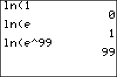

           
|Command Summary|Command Syntax|[Calculator Compatibility](compatibility.html)|[Token Size](tokens.html)|
|--- |--- |--- |--- |
|Computes the (principal branch of the) natural logarithm.|ln(*value*)|TI-83/84/+/SE|1 byte|

### Menu Location
Press the LN key to paste ln(.
# The ln( Command

The ln( command computes the natural logarithm of a value — the exponent to which the constant *[e](e-value.html)* must be raised, to get that value. This makes it the inverse of the *[e^(](e-exponent.html)* command.

ln( is a real number for all positive real values. For negative numbers, ln( is an imaginary number (so taking ln( of a negative number will cause [ERR:NONREAL ANS](errors.html#nonrealans) to be thrown in [Real](real-mode.html) mode), and of course it's a complex number for complex values. ln( is not defined at 0, even if you're in a complex mode.

## Advanced Uses

Using either the ln( or the [log(](log.html) command, logarithms of any base can be calculated, using the identity:
$$ 
\log_b{x} = \frac{\ln{x}}{\ln{b}} = \frac{\log{x}}{\log{b}}$$

So, to take the base B log of a number X, you could use either of the following equivalent ways:
```
:log(X)/log(B)
```
```
:ln(X)/ln(B)
```

This is the exponent to which B must be raised, to get X.

## Error Conditions

- **[ERR:DOMAIN](errors.html#domain)** when calculating ln(0).
- **[ERR:NONREAL ANS](errors.html#nonrealans)** if taking ln( of a negative number in [Real](real-mode.html) mode.

## Related Commands

- *[e](e-value.html)*
- *[e^(](e-exponent.html)*
- [log(](log.html)
- [logBASE(](logbase.html)
