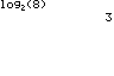

           
|Command Summary|Command Syntax|[Calculator Compatibility](compatibility.html)|[Token Size](tokens.html)|
|--- |--- |--- |--- |
|Allows you to find the log of a number using any base you want|logBASE(*value*,*base*)|TI-84+SE with TI-OS 2.53 MP|2 byte|

### Menu Location
Press:
1. ALPHA, then F2 (which is located over the WINDOW button)
1. 5 or arrow keys to move down to logBASE(
or
1. MATH
1. A or arrow keys to move down to logBASE(
       
# The logBASE( Command

The `logBASE(` command is a visual upgrade to the [`log(`](log.html) command to compute logarithms in any base *b*. That is, the command finds the exponent that base *b* must be raised to obtain the given value.

This command can be used on both the home screen and while programming.  If you are using [`CLASSIC`](classic-mode.html) mode, the command appears as:

```
logBASE(8,2)
            3
```

But in [MATHPRINT](mathprint-mode.html) mode, this is improved to:


log<sub>2</sub>(8)
@<&nbsp;&nbsp;&nbsp;&nbsp;&nbsp;&nbsp;&nbsp;&nbsp;&nbsp;&nbsp;&nbsp;&nbsp;>@3


## Formulas

The log in base *b* can also be found using the [`ln(`](ln.html) or [`log(`](log.html) commands.  This can be done indirectly using the change-of-base formula:

$$\log_bx = {\ln x \over \ln b} = {\log x \over \log b}$$

Or directly, using the optional second argument of `log(`:

```
logBASE(X,B

can be

log(X,B
```

The `logBASE(` command costs one extra byte compared to `log(`, providing only a visual improvement over its counterpart in `MATHPRINT` mode. The `log(` command is also compatible with older OS's, although its second argument is not. Both `logBASE(` and the second argument of `log(` are disabled in exam mode.

## Error Conditions

- **[ERR:ARGUMENT](errors.html#argument)** when a base is not specified
- **[ERR:DOMAIN](errors.html#domain)** when trying to compute the logarithm of 0
- **[ERR:NONREAL ANS](errors.html#nonrealans)** when trying to compute the logarithm of a negative number in [`Real`](real-mode.html) mode

## Related Commands

- [`log(`](log.html)
- [`ln(`](ln.html)
