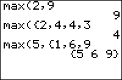

           
|Command Summary|Command Syntax|[Calculator Compatibility](compatibility.html)|[Token Size](tokens.html)|
|--- |--- |--- |--- |
|Returns the maximum of two elements or of a list.|* for two numbers: max(*x*,*y*)<br>* for a list: max(*list*)<br>* comparing a number to each element of a list: max(*x*,*list*) or max(*list*,*x*)<br>* pairwise comparing two lists: max(*list1*,*list2*)|TI-83/84/+/SE|1 byte|

### Menu Location
Press:<br># MATH to access the [math](math.html) menu.<br># RIGHT to access the NUM submenu.<br># 7 to select max(, or use arrows.<br><br>Alternatively, press:<br># 2nd LIST to access the list menu.<br># LEFT to access the MATH submenu.<br># 2 to select max(, or use arrows.
# The max( Command

`max(X,Y)` returns the largest of the two numbers `X` and `Y`. `max(*list*)` returns the largest element of *list*. `max(*list1*,*list2*)` returns the pairwise maxima of the two lists. `max(*list1*,X)` (equivalently, `max(X,*list1*)`) returns a list whose elements are the larger of `X` or the corresponding element of the original list.

```
max(2,3)
     3
max({2,3,4})
     4
max({1,3},{4,2})
     {4 3}
max({1,3},2)
     {2 3}
```

Unlike comparison operators such as < and >, `max(` can also compare complex numbers. To do this, both arguments must be complex — either complex numbers or complex lists: `max(2,*i*)` will throw an error even though `max(2+0*i*,*i*)` won't. In the case of complex numbers, the number with the largest absolute value will be returned. When the two numbers have the same absolute value, the first one will be returned: `max(*i*,-*i*)` returns *i* and `max(-*i*,*i*)` returns -*i*.

## Advanced Uses

`max(` can be used in Boolean comparisons to see if at least one of a list is 1 (true) — useful because commands like [`If`](if.html) or [`While`](while.html) only deal with numbers, and not lists, but comparisons like `L₁=L₂` return a list of values. In general, the behavior you want varies, and you will use the [`min(`](min.html) function or the `max(` function accordingly.

Using `max(` will give you a lenient test — if any one element of the list is 1 (true), then the `max(` of the list is true — this is equivalent to putting an [`or`](or.html) in between every element. For example, this tests if K is equal to any of 24, 25, 26, or 34 (the [`getKey`](getkey.html) arrow key values):

```
:If max(K={24,25,26,34
:Disp "ARROW KEY
```

To get the element of a real list in [`Ans`](ans.html) with the greatest absolute value, use `imag(max(*i*Ans))` or `max(abs(Ans))`.

`max(` can be also used along with `min(` to constrain a value between a lower and upper number:

```
:max(-1,min(1,100)) // returns 1 because 1 is between -1 & 100
:max(-1,min(1,0)) // returns 0 because 1 is not between -1 & 0
```

where the bounds for which the number 1 must fall between are first argument of `max(` and the second argument of `min(` in the above code.

## Error Conditions

- **[ERR:DATA TYPE](errors.html#datatype)** is thrown when comparing a real and a complex number. This can be avoided by adding +0*i* to the real number (or *i^4* right after it, for those who are familiar with complex numbers)
- **[ERR:DIM MISMATCH](errors.html#dimmismatch)** is thrown, when using `max(` with two lists, if they have different dimensions.

## Related Commands

- [`min(`](min.html)
- [`sum(`](sum.html)
- [`prod(`](prod.html)
