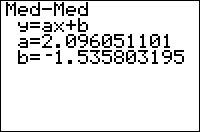

           
|Command Summary|Command Syntax|[Calculator Compatibility](compatibility.html)|[Token Size](tokens.html)|
|--- |--- |--- |--- |
|Calculates the median fit line through a set of points.|Med-Med [*x-list*, *y-list*, [*frequency*], [*equation*]|TI-83/84/+/SE|1 byte|

### Menu Location
Press:
1. STAT to access the statistics menu
2. LEFT to access the CALC submenu
3. 3 to select Med-Med, or use arrows
       
# The Med-Med Command

The Med-Med command is one of several that can calculate a line of best fit through a set of points. However, unlike the [LinReg(ax+b)](linreg(ax-b.html) and [LinReg(a+bx)](linreg(a-bx.html) commands, which generate the same result in different formats, Med-Med produces a different line entirely, known as the 'median fit line' or the 'median-median model'. This model is more resistant to outliers than the best-fit line produced by LinReg(ax+b)-type commands, in much the same way that the median of a set of data is more resistant to outliers than the mean. The process of calculating a median fit line is roughly as follows ([reference](http://www.amstat.org/publications/jse/v14n2/morrell.html)):
1. Divide the data into three equal groups by their x-values (the smallest third, the middle third, and the largest third)
2. Find the "median point" for each group by pairing the median x-value in the group with the median y-value (this need not be an actual data point).
3. These points are stored to (x₁,y₁), (x₂,y₂), and (x₃,y₃) on the calculator.
4. Find the line passing through the median point for the first and third group.
5. Shift this line one-third of the way toward the median point of the second group.

To use the Med-Med command, you must first store the points to two lists: one of the x-coordinates and one of the y-coordinates, ordered so that the nth element of one list matches up with the nth element of the other list. L₁ and L₂ are the default lists to use, and the List Editor (STAT > Edit...) is a useful window for entering the points. As you can see from the steps shown above, Med-Med requires at least three points with different x-values to work with.

In its simplest form, Med-Med takes no arguments, and calculates a regression line through the points in L₁ and L₂:
```
:{9,13,21,30,31,31,34→L₁
:{260,320,420,530,560,550,590→L₂
:Med-Med
```

On the home screen, or as the last line of a program, this will display the equation of the regression line: you'll be shown the format, y=ax+b, and the values of a and b. It will also be stored in the RegEQ variable, but you won't be able to use this variable in a program - accessing it just pastes the equation wherever your cursor was. Finally, the statistical variables a and b will be set as well. There are no diagnostics available for the Med-Med command, so r and r² will not be calculated or displayed even if you run [DiagnosticOn](diagnosticon.html).

You don't have to do the regression on L₁ and L₂, but if you don't you'll have to enter the names of the lists after the command. For example: 

```
:{9,13,21,30,31,31,34→FAT
:{260,320,420,530,560,550,590→CALS
:Med-Med ∟FAT,∟CALS
```

You can attach frequencies to points, for when a point occurs more than once, by supplying an additional argument - the frequency list. This list does not have to contain integer frequencies. If you add a frequency list, you must supply the names of the x-list and y-list as well, even when they're L₁ and L₂.

Finally, you can enter an equation variable (such as Y₁) after the command, so that the line of best fit is stored to this equation automatically. This doesn't require you to supply the names of the lists, but if you do, the equation variable must come last. You can use polar, parametric, or sequential variables as well, but since the line of best fit will be in terms of X anyway, this doesn't make much sense.

An example of Med-Med with all the optional arguments:

```
:{9,13,21,30,31,31,34→FAT
:{260,320,420,530,560,550,590→CALS
:{2,1,1,1,2,1,1→FREQ
:Med-Med ∟FAT,∟CALS,∟FREQ,Y₁
```

## Related Commands

- [LinReg(ax+b)](linreg(ax-b.html)
- [LinReg(a+bx)](linreg(a-bx.html)
- [LinRegTTest](linregttest.html)
- [LinRegTInt](linregtint.html)
- [Manual-Fit](manual-fit.html)
