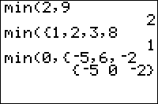

           
|Command Summary|Command Syntax|[Calculator Compatibility](compatibility.html)|[Token Size](tokens.html)|
|--- |--- |--- |--- |
|Returns the minimum of two elements or of a list.|* for two numbers: min(*x*,*y*)<br>* for a list: min(*list*)<br>* comparing a number to each element of a list: min(*x*,*list*) or min(*list*,*x*)<br>* pairwise comparing two lists: min(*list1*,*list2*)|TI-83/84/+/SE|1 byte|

### Menu Location
Press:<br># MATH to access the [math](math.html) menu.<br># RIGHT to access the NUM submenu.<br># 6 to select min(, or use arrows.<br><br>Alternatively, press:<br># 2nd LIST to access the list menu.<br># LEFT to access the MATH submenu.<br># ENTER to select min(.
# The min( Command

min(*x*,*y*) returns the smallest of the two numbers *x* and *y*. min(*list*) returns the smallest element of *list*. min(*list1*,*list2*) returns the pairwise minima of the two lists. min(*list1*,*x*) (equivalently, min(*x*,*list1*)) returns a list whose elements are the smaller of *x* or the corresponding element of the original list.

```
min(2,3)
     2
min({2,3,4})
     2
min({1,3},{4,2})
     {1 2}
min({1,3},2)
     {1 2}
```

Unlike [relational operators](operators.html#relational), such as < and >, min( can also compare complex numbers. To do this, both arguments must be complex — either complex numbers or complex lists: min(2,*i*) will throw a [ERR:DATA TYPE](errors.html#datatype) error even though min(2+0*i*,*i*) won't. In the case of complex numbers, the number with the smallest absolute value will be returned. When the two numbers have the same absolute value, the second one will be returned: min(*i*,-*i*) returns -*i* and min(-*i*,*i*) returns *i*.

## Advanced Uses

min( can be used in Boolean comparisons to see if every value of a list is 1 (true) — useful because commands like [If](if.html) or [While](while.html) only deal with numbers, and not [lists](lists.html), but comparisons like L1=L2 return a list of values. In general, the behavior you want varies, and you will use the min( or [max(](max.html) functions accordingly.

Using min( will give you a strict test — only if every single value of a list is true will min( return true. For example, the following code will test if two lists are identical — they have the same exact elements — and print EQUAL in that case:
```
:If dim(L1)=dim(L2
:Then
:If min(L1=L2
:Disp "EQUAL
:End
```

The first check, to see if the sizes are identical, is necessary because otherwise comparing the lists will return a [ERR:DIM MISMATCH](errors.html#dimmismatch) error.

## Error Conditions

- **[ERR:DATA TYPE](errors.html#datatype)** is thrown when comparing a real and a complex number. This can be avoided by adding 0*i* to the real number.
- **[ERR:DIM MISMATCH](errors.html#dimmismatch)** is thrown, when using min( with two lists, if they have different dimensions.

## Related Commands

- [max(](max.html)
- [sum(](sum.html)
- [prod(](prod.html)
