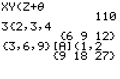

           
|Command Summary|Command Syntax|[Calculator Compatibility](compatibility.html)|[Token Size](tokens.html)|
|--- |--- |--- |--- |
|Returns the multiplication of two numbers.|*value1* * *value2*|TI-83/84/+/SE|1 byte|

### Menu Location
Press [*]
       
# The * Command

The * (multiply) operator takes two numbers, variables, or expressions and multiplies their values together, thus returning a single new value. The * operator appears higher in the order of operations than both [+](add.html) and [-](subtract.html), so if those appear in an expression, * will be executed first. In addition, the [/](divide.html) operator has the same order of operations as *, so the calculator simply executes them left to right in the order that they appear.

```
:1*1
           1

:5→X
:2*3X
           30

:2→A:3→B
:A/B*B/A
           1
```

## Advanced Uses

As it turns out, the most advanced way to use * is by not using it at all. On z80-based TI calculators, two adjacent expressions or variables are implicilty multiplied even without a * mark.

```
:5*A
should be
:5A

:5*cos(N*θ
should be
:5cos(Nθ
```

There are a few cases in which omitting the multiplication sign doesn't work. For example, 2^4*[E](e-ten.html)3 (which evaluates to 16000) can't be replaced by 2^4E3, since the latter is interpreted as 2^(4000).

## Optimization

The * sign has the same truth value as the [and](and.html) operator because they both return zero if one or more of the numbers is zero (based on Boolean logic). Consequently, you sometimes see people implicitly multiplying expressions together in [conditionals](if.html) and [loops](while.html), instead of joining them together with and. Unfortunately, this is not only usually larger in size, but often times slower.

```
:If (A=2)(B=7
should be
:If A=2 and B=7
```

It does save some space when you can avoid using parentheses:
```
:If A and B
could be
:If AB
```

## Timing

The amount of time taken to multiply two real floating-point numbers varies with the sum of the digits (including in the fractional part) of the right argument. On a 15 MHz calculator, a single multiplication in the worst case (when the right argument is 99999999999999) takes 3.3 ms, the best case (when the right argument is 0) takes about 0.1 ms, and the average case (for fourteen-digit floating point numbers) takes about 1.7 ms.

These timings do not include parser overhead or variable recall time, which are often significant in overall program speed.

## Related Commands

- + ([add](add.html))
- - ([subtract](subtract.html))
- / ([divide](divide.html))
