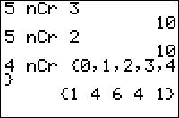

           
|Command Summary|Command Syntax|[Calculator Compatibility](compatibility.html)|[Token Size](tokens.html)|
|--- |--- |--- |--- |
|Calculates the combinatorial number of combinations.|*a* nCr *b*|TI-83/84/+/SE|1 byte|

### Menu Location
Press:
1. MATH to access the [math](math.html) menu.
2. LEFT to access the PRB submenu.
3. 3 to select nCr, or use arrows.
       
# The nCr Command

nCr is the number of combinations function (or binomial coefficient), defined as *a* nCr *b* = *a*!/(*b*!*(*a*-*b*)!), where *a* and *b* are nonnegative integers. The function also works on lists.

**Tip**: nCr has a higher priority in evaluation than operators such as + or *: for example, 5X nCr 10 will be interpreted as 5(X nCr 10) and not as (5X) nCr 10. You might wish to use parentheses around complex expressions that you will give to nCr as arguments.

```
6 nCr 4
     15
```

The combinatorial interpretation of *a* nCr *b* is the number of ways to choose *b* objects, out of a total of *a*, if order doesn't matter. For example, if there 10 possible pizza toppings, there are 10 nCr 3 ways to choose a 3-topping pizza.

## Error Conditions

- **[ERR:DIM MISMATCH](errors.html#dimmismatch)** is thrown when applying nCr to two lists that have different dimensions.
- **[ERR:DOMAIN](errors.html#domain)** is thrown for negative integers or decimals.

## Related Commands

- [nPr](npr.html)
- [!](factorial.html)
