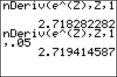

           
|Command Summary|Command Syntax|[Calculator Compatibility](compatibility.html)|[Token Size](tokens.html)|
|--- |--- |--- |--- |
|Calculates the approximate numerical derivative of a function, at a point.|nDeriv(*f*(*variable*),*variable*,*value*[,*h*])|TI-83/84/+/SE|1 byte|

### Menu Location
Press:<br># MATH to access the [math](math.html) menu.<br># 8 to select nDeriv(, or use arrows.
# The nDeriv( Command

`nDeriv(f(var),var,value[,h])` computes an approximation to the value of the derivative of *f*(*var*) with respect to *var* at *var*=*value*. *h* is the step size used in the approximation of the derivative. The default value of *h* is 0.001.

`nDeriv(` only works for real numbers and expressions. `nDeriv(` can be used only once inside another instance of `nDeriv(`.

```
π→X
     3.141592654
nDeriv(sin(T),T,X)
     -.9999998333
nDeriv(sin(T),T,X,(abs(X)+E⁻6)E⁻6)
     -1.000000015
nDeriv(nDeriv(cos(U),U,T),T,X)
     .999999665
```

## Advanced

If the default setting for *h* doesn't produce a good enough result, it can be difficult to choose a correct substitute. Although larger values of *h* naturally produce a larger margin of error, it's not always helpful to make *h* very small. If the difference between *f(x+h)* and *f(x-h)* is much smaller than the actual values of *f(x+h)* or *f(x-h)*, then it will only be recorded in the last few significant digits, and therefore be imprecise.

A suitable compromise is to choose a tolerance *h* that's based on X. As suggested [here](http://www.unitedti.org/index.php?act-st-f-54-t-4367-hl-view-findpost-p-68526), `(abs(X)+]E⁻6)E⁻6` is a reasonably good value that often gives better results than the default. 


## Formula

The exact formula that the calculator uses to evaluate this function is:

$$
\operatorname{nDeriv}(f(t),t,x,h)=\frac{f(x+h)-f(x-h)}{2h}$$


This formula is known as the [symmetric derivative](https://en.wikipedia.org/wiki/symmetric_derivative), and using it generally increases the accuracy of the calculation. However, in a few instances it can give erroneous answers. One case where it gives false answers is with the function, 

$$
f(x) = \dfrac{1}{x^2} \bigg\vert_{x=0}$$

This derivative is undefined when calculated algebraically, but due to the method of calculation, the derivative given by `nDeriv(` is zero. These problems can be avoided by ensuring that a function's derivative is defined at the point of interest.

## Error Conditions

- **[ERR:DOMAIN](errors.html#domain)** is thrown if *h* is 0 (since this would yield division by 0 in the formula)
- **[ERR:ILLEGAL NEST](errors.html#illegalnest)** is thrown if `nDeriv(` commands are nested more than one level deep. Just having one `nDeriv(` command inside another is okay, though.

## Related Commands

- [`fMin(`](fmin.html)
- [`fMax(`](fmax.html)
- [`fnInt(`](fnint.html)
