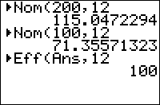

           
|Command Summary|Command Syntax|[Calculator Compatibility](compatibility.html)|[Token Size](tokens.html)|
|--- |--- |--- |--- |
|Converts an effective interest rate to a nominal interest rate.|►Nom(*interest rate*,*compounding periods*)|TI-83/84/+/SE|2 bytes|

### Menu Location
On the TI-83, press:
1. 2nd FINANCE to access the finance menu.
2. ALPHA B to select ►Nom(.

On the TI-83+ or higher, press:
1. APPS to access the applications menu.
2. ENTER or 1 to select Finance...
3. ALPHA B to select ►Nom(.
       
# The ►Nom( Command

The ►Nom( command converts from an effective interest rate to a nominal interest rate. In other words, it converts an interest rate that takes compounding periods into account into one that doesn't. The two arguments are 1) the interest rate and 2) the number of compounding periods.

For example, you want to know the interest rate, compounded monthly, that will yield a total increase of 10% per year:

```
►Nom(10,12)
    9.568968515
```

## Formulas

The formula for converting from an effective rate to a nominal rate is:

$$\operatorname{Nom}=100 \operatorname{CP} \left(\sqrt[\operatorname{CP}]{\frac{\operatorname{Eff}}{100}+1}-1\right)$$

Here, Eff is the effective rate, Nom is the nominal rate, and CP is the number of compounding periods.

## Error Conditions

- **[ERR:DOMAIN](errors.html#domain)** is thrown if the number of compounding periods is not positive, or if the nominal rate is -100% or lower (an exception's made for the nominal rate if there is only one compounding period, since ►Nom(X,1)=X).

## Related Commands

- [►Eff(](-eff.html)
