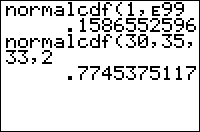

           
|Command Summary|Command Syntax|[Calculator Compatibility](compatibility.html)|[Token Size](tokens.html)|
|--- |--- |--- |--- |
|Finds the probability for an interval of the normal curve.|normalcdf(*lower*, *upper* [, *μ*, *σ*])|TI-83/84/+/SE|2 bytes|

### Menu Location
Press:<br># 2ND DISTR to access the distribution menu<br># 2 to select normalcdf(, or use arrows.
# The normalcdf( Command

normalcdf( is the normal (Gaussian) cumulative density function. If some random variable follows a normal distribution, you can use this command to find the probability that this variable will fall in the interval you supply.

There are two ways to use normalcdf(. With two arguments (lower bound and upper bound), the calculator will assume you mean the standard normal distribution, and use that to find the probability corresponding to the interval between "lower bound" and "upper bound". You can also supply two additional arguments to use the normal distribution with a specified mean and standard deviation. For example:

```
for the standard normal distribution
:normalcdf(-1,1

for the normal distribution with mean 10 and std. dev. 2.5
:normalcdf(5,15,10,2.5
```

## Advanced

Often, you want to find a "tail probability" - a special case for which the interval has no lower or no upper bound. For example, "what is the probability x is greater than 2?". The TI-83+ has no special symbol for infinity, but you can use E99 to get a very large number that will work equally well in this case (E is the decimal exponent obtained by pressing [2nd] [EE]). Use E99 for positive infinity, and -E99 for negative infinity.

The normal distribution is often used to approximate the binomial distribution when there are a lot of trials. This isn't really necessary on the TI-83+ because the [binompdf(](binompdf.html) and [binomcdf(](binomcdf.html) commands are already very fast - however, the normal distribution can be slightly faster, and the skill can come in handy if you don't have access to a calculator but do have a table of normal distributions (yeah, right). Here is how to convert a binomial distribution to a normal one:
```
:binompdf(N,P,X
can be
:normalcdf(X-.5,X+.5,NP,√(NP(1-P

:binomcdf(N,P,X,Y
can be
:normalcdf(X-.5,Y+.5,NP,√(NP(1-P
```

How much faster this is will depend on N and P, since the binomial distribution takes a long time to evaluate for large values of N, but the normal distribution takes about the same time for any mean and standard deviation. Also, this is an approximation that is only valid for some binomial distributions - a common rule of thumb is NP>10.

## Formulas

As with other continuous distributions, any probability is an integral of the probability density function. Here, too, we can define normalcdf( for the standard normal case in terms of [normalpdf(](normalpdf.html):
$$ \operatorname{normalcdf}(a,b)=\int_a^b \operatorname{normalpdf}(x) \, \mathrm{d}x=\frac1{\sqrt{2\pi\,}} \int_a^b e^{-\frac1{2}x^2} \, \mathrm{d}x $$

or in terms of the [error function](http://mathworld.wolfram.com/erf.html):
$$ \operatorname{normalcdf}(a,b)=\frac1{2}\left(\operatorname{erf}\left(\frac{b}{\sqrt{2}}\right)-\operatorname{erf}\left(\frac{a}{\sqrt{2}}\right)\right) $$

For the arbitrary mean μ and standard deviation σ, normalcdf( is defined in terms of the standard normal distribution, with the bounds of the interval standardized:
$$ \operatorname{normalcdf}(a,b,\mu,\sigma)=\operatorname{normalcdf}\left(\frac{a-\mu}{\sigma},\frac{b-\mu}{\sigma} \right) $$

## Related Commands

- [normalpdf(](normalpdf.html)
- [invNorm(](invnorm.html)
- [ShadeNorm(](shadenorm.html)
