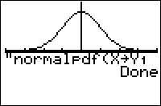

           
|Command Summary|Command Syntax|[Calculator Compatibility](compatibility.html)|[Token Size](tokens.html)|
|--- |--- |--- |--- |
|Evaluates the normal probability density function at a point.|normalpdf(*x*[,*μ*, *σ*])|TI-83/84/+/SE|2 bytes|

### Menu Location
Press: # 2ND DISTR to access the distribution menu # ENTER to select normalpdf(.
# The normalpdf( Command

normalpdf( is the normal (Gaussian) probability density function. 

Since the normal distribution is continuous, the value of normalpdf( doesn't represent an actual probability - in fact, one of the only uses for this command is to draw a graph of the normal curve. You could also use it for various calculus purposes, such as finding inflection points. 

The command can be used in two ways: normalpdf(*x*) will evaluate the standard normal p.d.f. (with mean at 0 and a standard deviation of 1) at *x*, and normalpdf(*x*,*μ*,*σ*) will work for an arbitrary normal curve, with mean *μ* and standard deviation *σ*. 

## Formulas

For the standard normal distribution, normalpdf(*x*) is defined as
$$ \operatorname{normalpdf}(x)=\frac1{\sqrt{2\pi\,}} \, e^{-\frac1{2}x^2} $$

For other normal distributions, normalpdf( is defined in terms of the standard distribution:
$$ \operatorname{normalpdf}(x,\mu,\sigma)=\frac{1}{\sigma} \, \operatorname{normalpdf} \left(\frac{x-\mu}{\sigma}\right) $$

## Related Commands

- [normalcdf(](normalcdf.html)
- [invNorm(](invnorm.html)
- [ShadeNorm(](shadenorm.html)
