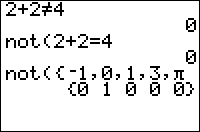

           
|Command Summary|Command Syntax|[Calculator Compatibility](compatibility.html)|[Token Size](tokens.html)|
|--- |--- |--- |--- |
|Flips the truth value of its argument.|not(*value*)|TI-83/84/+/SE|1 byte|

### Menu Location
Press:
1. 2nd TEST to access the test menu.
1. RIGHT to access the LOGIC submenu.
1. 4 to select not(, or use arrows and ENTER.
       
# The not( Command

The last logical operator available on the 83 series takes only one value as input.  **not(** comes with its own parentheses to make up for this loss.  Quite simply, it negates the input: False becomes True (1) and True returns False (0).   not( can be nested; one use is to make any True value into a 1.
```
:not(0)
           1

:not(-20 and 14)

           0

:not(not(2))
           1
```

## Advanced Uses

not(not(X)) will make any value X into 1 if it's not 0, and will keep it 0 if it is.

## Optimization

not(X) and X=0 have the same truth value, but not( is shorter if the closing parenthesis is omitted:

```
:If A=0
can be
:If not(A
```

## Related Commands

- [and](and.html)
- [or](or.html)
- [xor](xor.html)
