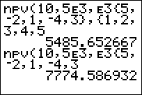

           
|Command Summary|Command Syntax|[Calculator Compatibility](compatibility.html)|[Token Size](tokens.html)|
|--- |--- |--- |--- |
|Computes the net present value of money over a specified time period.|npv(*interest rate*,*CF0*,*CFList*[,*CFFreq*])|TI-83/84/+/SE|2 bytes|

### Menu Location
Press:
1. 2nd FINANCE (on a TI-83) or APPS (TI-83+ or higher) to access the finance menu
1. On the TI-83+ or higher, select the first option "Finance..." from the APPS menu
1. 7 or use arrow keys to scroll to it
       
# The npv( Command

The `npv(` command computes the net present value of money over a specified time period. If a positive value is returned after executing `npv(`, that means it was a positive cashflow; otherwise it was a negative cashflow. The `npv(` command takes four arguments, and the fourth one is optional:

- **interest rate** — the percentage of the money that is paid for the use of that money over each individual period of time.
- **CF0** —  the initial amount of money that you start out with; this number must be a real number, otherwise you will get a [ERR:DATA TYPE](errors.html#datatype) error.
- **CFList** — the list of cash flows added or subtracted after the initial money.
- **CFFreq** — the list of frequencies of each cash flow added after the initial money; if this is left off, each cash flow in the cash flow list will just appear once by default.

## Sample Problem

Your mom recently opened a bank account for you, with $500 as a gift to start you off. This is welcome news to you, until you find out that the bank charges 5% as the interest rate for the account. So, you get a job at Rocco's Pizzas delivering pizzas, which brings in $1,000-$2,000 each month. For the last five months, in particular, you have earned $1,250, $1,333, $1,575, $1,100, and $1,900. (Assume there are no other expenses, such as gas, car payment, etc.)

Plugging in all of the different values into the `npv(` command, this is what our code looks like:

```
:npv(5,500,{1250,1333,1575,1100,1900
```

## Optimization

The `npv(` command's optional fourth argument should be left off if each cash flow of money in the list of cash flows just appears once.

```
:npv(5,1550,{2E3,3E3,4E3},{1,1,1
can be
:npv(5,1550,{2E3,3E3,4E3
```

At the same time, if there are cash flows that occur multiple times, it can be smaller to just use the frequency argument:

```
:npv(8,0,{200,200,300,300,300
can be
:npv(8,0,{200,300},{2,3
```

## Formulas

Without a frequency list, the formula for `npv(` is the following:
$$
\operatorname{npv}(i,\operatorname{CF}_0,\{\operatorname{CF}_j\})=\sum_{j=0}^N{\operatorname{CF}_j\left(1+\frac{i}{100}\right)^{-j}}$$

When a frequency list is used, the same formula can be applied if we expand the list with frequencies into a long list without frequencies. However, it's possible to do the calculation directly. We define the cumulative frequency S<sub>j</sub> as the sum of the first j frequencies (S<sub>0</sub> is taken to be 0):

$$
\operatorname{npv}(i,\operatorname{CF}_0,\{\operatorname{CF}_j\},\{n_j\})
=\operatorname{CF}_0+\sum_{j=1}^N{\operatorname{CF}_j\left(1+\frac{i}{100}\right)^{S_{j-1}}\frac{(1-(1+\frac{i}{100})^{-n_j})}{i}}$$


## Error Conditions

- **[ERR:DATA TYPE](errors.html#datatype)** is thrown if you try to use anything other than a real number for the interest rate.
- **[ERR:DIM MISMATCH](errors.html#dimmismatch)** is thrown if the list of cash flows and the list of cash flow frequencies have different dimensions.

## Related Commands

- [`irr(`](irr.html)
