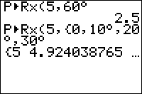

           
|Command Summary|Command Syntax|[Calculator Compatibility](compatibility.html)|[Token Size](tokens.html)|
|--- |--- |--- |--- |
|P►Rx( calculates the x-value (in Cartesian coordinates) given Polar coordinates.|P►Rx(r,θ)|TI-83/84/+/SE/CE|1 byte|

### Menu Location
Press:<br># 2nd ANGLE to access the angle menu.<br># 7 to select P►Rx(, or use arrows and ENTER.
# The P►Rx( Command

P►Rx( (polar►rectangular x-coordinate) calculates the x-coordinate of a polar point.  Polar coordinates are of the form (r,θ), where θ is the counterclockwise angle made with the positive x-axis, and r is the distance away from the origin (the point (0,0)).  The conversion identity x=r*cos(θ) is used to calculate P►Rx(.

The value returned depends on whether the calculator is in [radian](radian-mode.html) or [degree](degree-mode.html) mode. A full rotation around a circle is 2π radians, which is equal to 360°. The conversion from radians to degrees is angle*180/π and from degrees to radians is angle*π/180.  The P►Rx( command also accepts a list of points.

```
P►Rx(5,π/4)
	3.535533906
5*cos(π/4)
	3.535533906
P►Rx({1,2},{π/4,π/3})
	{.7071067812 1}
```

## Advanced Uses

You can bypass the mode setting by using the [°](degree-symbol.html) (degree) and <sup>[r](radian-symbol.html)</sup> (radian) symbols.  This next command will return the same values no matter if your calculator is in degrees or radians:
```
P►Rx(1,{π/4^^r,60°})
	{.7071067812 .5}
```

## Optimization

In most cases P►Rx(r,θ) can be replaced by r*cos(θ) to save a byte:

```
:P►Rx(5,π/12)
can be
:5cos(π/12)
```

Conversely, complicated expressions multiplied by a cosine factor can be simplified by using P►Rx(r,θ) instead.

```
:(A+BX)cos(π/5)
can be
:P►Rx(A+BX,π/5)
```

## Error Conditions

- **[ERR:DIM MISMATCH](errors.html#dimmismatch)** is thrown if two list arguments have different dimensions.
- **[ERR:DATA TYPE](errors.html#datatype)** is thrown if you input a complex argument.

## Related Commands

- [P►Ry(](p-ry.html)
- [R►Pr(](r-pr.html)
- [R►Pθ(](r-ptheta.html)
- [cos(](cos.html)
