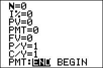

           
|Command Summary|Command Syntax|[Calculator Compatibility](compatibility.html)|[Token Size](tokens.html)|
|--- |--- |--- |--- |
|Sets the TVM solver to use payments at the end of a period.|Pmt_End|TI-83/84/+/SE|2 bytes|

### Menu Location
On the TI-83, press:
1. 2nd FINANCE to access the finance menu.
2. ALPHA E to select Pmt_End, or use arrows and ENTER.

On the TI-83+ or higher, press:
1. APPS to access the applications menu.
2. ENTER to select Finance...
3. ALPHA E to select Pmt_End, or use arrows and ENTER.
       
# The Pmt_End Command

The Pmt_End and [Pmt_Bgn](pmt_bgn.html) commands toggle a setting with the finance solver. In Pmt_End mode, the calculator assumes that the payments are made at the end of each time period, rather than at the beginning. 

Make sure to set the calculator to one of the modes before using the finance solving commands in a program, since otherwise the result is unpredictable.

## Related Commands

- [Pmt_Bgn](pmt_bgn.html)
